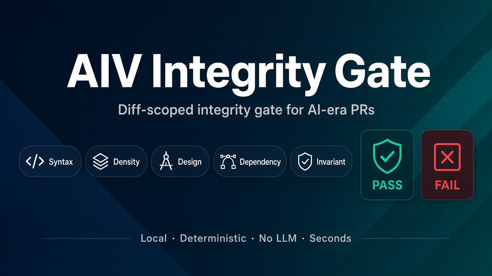
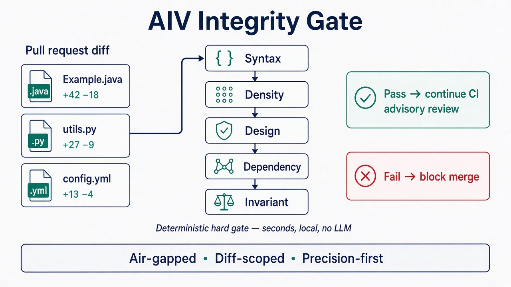
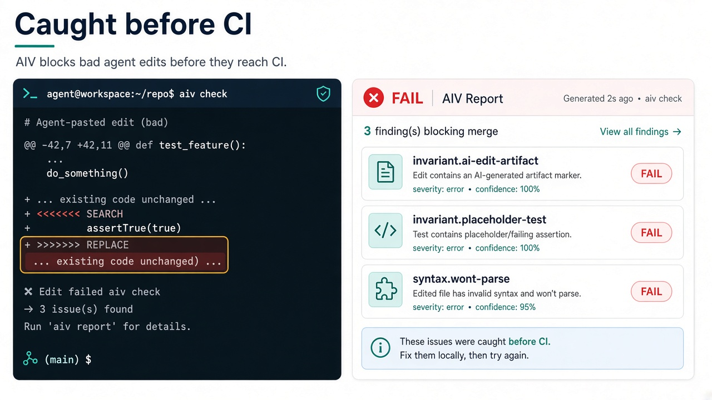
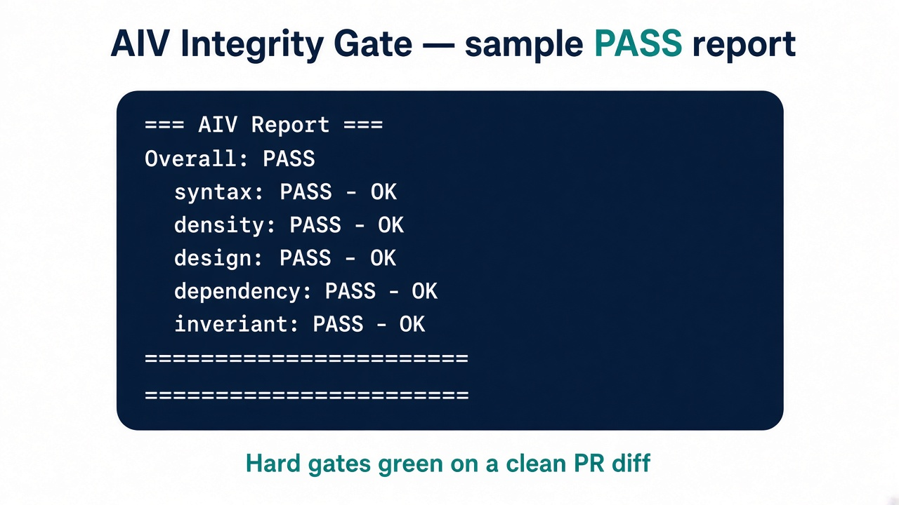
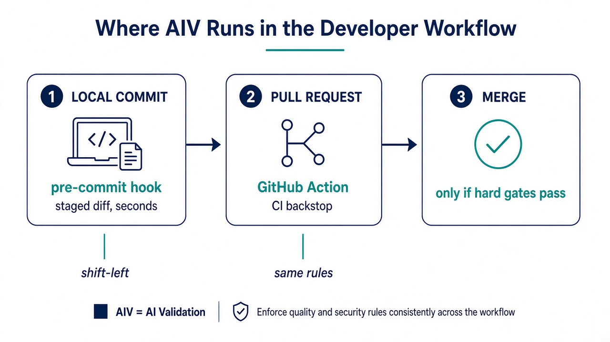
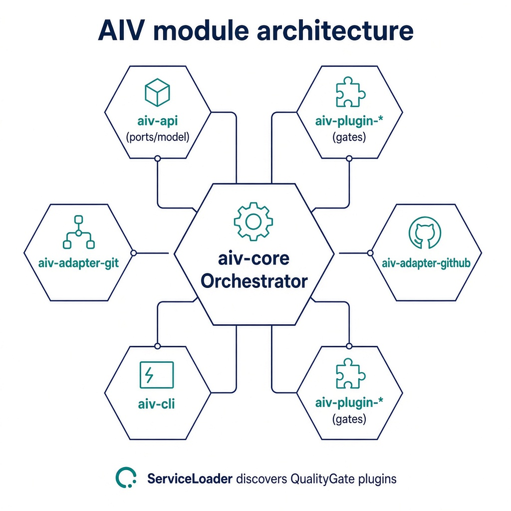

# AIV Integrity Gate

<p align="center">
  
</p>

<p align="center">
  <a href="https://github.com/vaquarkhan/aiv-integrity-gate/actions/workflows/aiv.yml"></a>
  <a href="https://central.sonatype.com/artifact/io.github.vaquarkhan/aiv-cli"></a>
  <a href="LICENSE"></a>
</p>

## One sentence

**Fast, local check on your diff: block won't-parse files, leftover conflict / agent paste junk, fake tautology tests, and bad imports - almost never blocks a good PR.**

Best used at **commit time** ([docs/PRE-COMMIT.md](docs/PRE-COMMIT.md)), with CI as backup.

## What AIV looks like

PR diff goes through hard gates in seconds (local JAR, no LLM API):

<p align="center">
  
</p>

| Bad agent paste → **FAIL** | Clean diff → **PASS** |
|:---:|:---:|
|  |  |

Where it runs (same rules both places):

<p align="center">
  
</p>

### Why this adds value

| Without AIV | With AIV |
|-------------|---------|
| Broken / unparseable files burn the full CI matrix | **Syntax** fails in seconds (hard) |
| Agent paste leaves `... existing code ...` or SEARCH/REPLACE junk | **Invariant** edit-artifact rules on **added lines** (hard) |
| Empty `assertTrue(true)` / `expect(true).toBe(true)` tests | **Invariant** placeholder-test on test paths (hard) |
| Hallucinated imports look fine until runtime | **Dependency** vs pom / requirements (hard when enabled) |
| Soft structure signals | **Density / cohesion** warn/label only; optional Copilot after AIV - [docs/pipeline-aiv-copilot.md](docs/pipeline-aiv-copilot.md) |

Architecture (hexagonal modules + ServiceLoader plugins):

<p align="center">
  
</p>

Details: **[docs/ARCHITECTURE.md](docs/ARCHITECTURE.md)** · Contributor runbook: **[docs/DEVELOPER-GUIDE.md](docs/DEVELOPER-GUIDE.md)** · Deep walkthrough: **[docs/TUTORIAL.md](docs/TUTORIAL.md)** · Diagrams: **[docs/images/](docs/images/)**

### Why not PMD, Semgrep, or Checkstyle?

They are great **whole-repo** static analyzers. AIV is a **diff-scoped** integrity gate (density, design YAML, imports vs manifests, **syntax** parse checks, optional docs). See the comparison grid below and [docs/WHY-NOT-PMD-SEMGREP.md](docs/WHY-NOT-PMD-SEMGREP.md).

| | **AIV** | **PMD / Semgrep / Checkstyle** |
|--|---------|--------------------------------|
| **Scope** | PR diff by default | Project-wide rulesets |
| **Sweet spot** | Objectively broken AI/agent artifacts + design/import surface on **changed / added** lines | Bugs, style, security patterns across the tree |
| **Config** | `.aiv/config.yaml` + rules in-repo | Tool-specific XML/YAML |
| **Air gap** | Single shaded JAR + local rules | Varies; all can run offline |

### Identity (licensing vs project)

- **Maven coordinates:** `io.github.vaquarkhan` - this is **not** an Apache Software Foundation (ASF) project.
- **License:** [Apache License 2.0](LICENSE) applies to **this software’s source** (standard OSS license text). It does **not** mean ASF incubation or `org.apache.*` packages.

**Author:** Vaquar Khan

---

## See it in CI

- **Live runs:** [GitHub Actions on this repository](https://github.com/vaquarkhan/aiv-integrity-gate/actions) - open a workflow run and expand the job for pass/fail and logs.
- **What to look for:** a failing run when a change trips **syntax**, **density**, **design**, **dependency**, or **invariant** (when enabled). Same signal as the demos above.
- **Diagrams:** [`docs/images/`](docs/images/) (hero, value-flow, fail/pass demos, shift-left, architecture).

---

## Quick start (about five minutes)

You are done when a PR runs AIV and prints a report (pass or fail).

1. **Download the CLI (no clone required)** - From Maven Central, fetch the shaded uber JAR. The version must match the reactor `<version>` in this project’s root [`pom.xml`](pom.xml) (current line: **1.0.4**). See [docs/MAVEN-VERSION.md](docs/MAVEN-VERSION.md) for `${project.version}`, coordinates, and scripted downloads.

   ```bash
   curl -fsSL -o aiv-cli.jar "https://repo1.maven.org/maven2/io/github/vaquarkhan/aiv/aiv-cli/1.0.4/aiv-cli-1.0.4.jar"
   ```

   From a **clone** of this repo you can resolve the version with Maven instead of hardcoding it:

   ```bash
   VERSION="$(mvn -q -DforceStdout help:evaluate -Dexpression=project.version -f pom.xml)"
   curl -fsSL -o aiv-cli.jar "https://repo1.maven.org/maven2/io/github/vaquarkhan/aiv/aiv-cli/${VERSION}/aiv-cli-${VERSION}.jar"
   ```

   Or use [scripts/install-aiv.sh](scripts/install-aiv.sh) or [scripts/print-maven-version.sh](scripts/print-maven-version.sh) (same version source, configurable `AIV_VERSION`).

2. **Bootstrap config** - `java -jar aiv-cli.jar init --workspace .` writes `.aiv/config.yaml` and starter `.aiv/design-rules.yaml` from a quick language sniff, or copy from [`example-project/`](example-project/).

3. **Shift left (recommended)** - Install the [pre-commit hook](docs/PRE-COMMIT.md) so bad agent paste never becomes a PR:

   ```yaml
   # .pre-commit-config.yaml
   repos:
     - repo: https://github.com/vaquarkhan/aiv-integrity-gate
       rev: v1.0.4
       hooks:
         - id: aiv-gate
   ```

4. **Wire CI as backstop** - Prefer the [composite action](action.yml) (`vaquarkhan/aiv-integrity-gate@v1`), or adapt [`example-project/.github/workflows/aiv.yml`](example-project/.github/workflows/aiv.yml).

5. **Open a pull request** - Intentionally violate a design rule (e.g. `System.exit` with the sample rules) to see a **fail**, then fix to **pass**.

**Developers changing AIV itself:** see **[docs/DEVELOPER-GUIDE.md](docs/DEVELOPER-GUIDE.md)** (build, verify, run shaded JAR, add a gate). User guides: [docs/TUTORIAL.md](docs/TUTORIAL.md), [docs/ARCHITECTURE.md](docs/ARCHITECTURE.md), [docs/MAVEN-VERSION.md](docs/MAVEN-VERSION.md), [docs/DEPLOYMENT.md](docs/DEPLOYMENT.md), [docs/DEVELOPER-CONFIGURATION.md](docs/DEVELOPER-CONFIGURATION.md). **Release notes:** [CHANGELOG.md](CHANGELOG.md).

---

## Problems and Solutions

| Pain Area | What Happens | Feature That Addresses It |
|-----------|--------------|---------------------------|
| Broken AI/agent paste | Partial LLM pastes, elision markers, SEARCH/REPLACE junk, conflict markers | **Invariant** (`ai-edit-artifact`, merge markers) on **added lines** |
| Fake tests | `assertTrue(true)` / `expect(true).toBe(true)` dumps | **Invariant** `placeholder-test` (test paths only) |
| Won't-parse / guaranteed CI fail | Broken Java/Python/YAML/JSON that would fail later in the matrix | **Syntax** pre-gate (precision-first: skips when uncertain) |
| Unknown imports | Typos or imports not in lockfile | **Dependency** vs pom / requirements (stdlib + first-party allowed) |
| Design drift | Forbidden APIs / missing required patterns | **Design** YAML rules (+ attribution phrases if you enable them) |
| Soft structure signals | Verbose scaffolding, multi-area sprawl | **Density / cohesion** as **warn + PR label** (not sole hard block) |
| Urgent merges | Need to bypass for hotfix | `/aiv skip` on its own line in the **latest** PR commit (optional `skip_allowlist`) |
| Refactors flagged | Deletion-heavy changes trip density | Refactor exception (net lines threshold) |
| Trusted authors | Maintainers hit soft gates | `trusted_authors` bypass for density |
| Issue squatting | Assigned then ghost | Assignment Gate: assign after AIV passes |

---

## What This Tool Does

When someone opens a pull request, AIV runs a set of checks on the changed files:

1. **Density** - Does the code have enough real logic, or is it mostly scaffolding? Empty classes and copy-paste boilerplate get flagged.

2. **Design** - Does the code follow your project's rules? You define forbidden patterns (for example, do not use `System.exit`) and required patterns. Prefer **objective AI markers** (e.g. "Generated by ChatGPT", "as an AI language model") over emoji hard-blocks — emoji appears in legitimate code and is a poor slop selector.

3. **Dependency** - Are new imports in Java and Python files declared in your lockfile? Python **stdlib** and **first-party** packages (directories with `__init__.py`) are allowed automatically so real projects are not false-flagged.

4. **Syntax** - Do changed Java / Python / YAML / JSON files **parse**? Catches guaranteed downstream CI failures in milliseconds. Precision-first: skips when the toolchain is missing or the file is intentionally non-strict (templated YAML, `tsconfig*.json`, `Dockerfile.java`).

5. **Invariant** - Merge-conflict markers, TBD/FIXME/XXX placeholders, and **AI edit-artifacts** in code files only (elision markers, assistant chatter, `<<<<<<< SEARCH` / `>>>>>>> REPLACE`). Off by default in this repo's dogfood config; enable when you want those hard blocks.

6. **Doc Integrity** - Validates documentation files (.md, .txt, .rst): path existence, cross-references, required mentions, command completeness, path fabrication. Enable via **`--include-doc-checks`** (forces the gate on every run) or via config (`enabled: true` plus **`auto: true`** to run only when the diff touches docs). See [docs/DEVELOPER-CONFIGURATION.md](docs/DEVELOPER-CONFIGURATION.md#doc-integrity-gate) for the decision table.

AIV works with Java, Python, Go, Rust, Kotlin, Scala, JavaScript, TypeScript, C, C++, Ruby, and shell. The density gate runs full logic checks on Java only; other languages get entropy checks. Design and dependency checks apply to whatever languages you configure. Syntax covers Java, Python, YAML, and JSON.

No API keys or paid services are required for the hard gate. Everything runs locally in your CI. Optional advisory Copilot review can run **after** AIV passes — see [docs/pipeline-aiv-copilot.md](docs/pipeline-aiv-copilot.md).

---

## Modules

| Module | Purpose |
|--------|---------|
| `aiv-api` | Interfaces, models, and extension points |
| `aiv-core` | Orchestrator that runs gates in sequence |
| `aiv-plugin-density` | Logic density and entropy checks |
| `aiv-plugin-design` | Design compliance via YAML rules (Java-aware surface matching; phrase boundaries for prose-like markers) |
| `aiv-plugin-dependency` | Import validation against pom.xml and requirements (Python stdlib + first-party allowlist) |
| `aiv-plugin-syntax` | Parse-validity pre-gate (Java, Python, YAML/JSON) |
| `aiv-plugin-invariant-template` | Invariant gate (merge markers, placeholders, AI edit-artifacts; enable in config) |
| `aiv-plugin-doc-integrity` | Documentation integrity (paths, cross-refs, commands) |
| `aiv-adapter-git` | Git diff provider |
| `aiv-adapter-github` | **Default:** `StdoutReportPublisher` (human-readable report to stdout). **Optional:** `GithubChecksPublisher` when you pass **`--publish-github-checks`** (requires `GITHUB_TOKEN` and repository env). |
| `aiv-cli` | Command-line entry point |

---

## Build and Run

Build the project:

```bash
mvn clean package
```

Run AIV from the repo root (compare your working tree to `origin/main`). Replace the JAR name with your Maven `${project.version}` (for example `1.0.4`):

```bash
java -jar aiv-cli/target/aiv-cli-1.0.4.jar --diff origin/main
```

Or via Maven:

```bash
mvn -pl aiv-cli exec:java -Dexec.args="--diff origin/main"
```

**Exit codes**

| Code | Meaning |
|------|---------|
| `0` | All blocking gates passed (or `doctor` mode - informational only). |
| `1` | At least one blocking gate failed. |
| `2` | Invalid arguments or configuration (including unreadable `--output-json` path). |
| `3` | Git subprocess failure (bad ref, dirty state, etc.). |
| `4` (optional) | Set with `--warnings-exit-code 4` when the run **passed** but emitted **notices** (e.g. oversized files skipped from scanning). Default remains `0` in that case. |

**Structured output:** `--output-json path/to/aiv-report.json` writes `schema_version: 2`, top-level **`doctor_mode`** (set `true` for `doctor` subcommand runs), and per-gate **`findings`**. Pipelines should treat **`passed`** as non-blocking when **`doctor_mode`** is `true`. **`--output-sarif`** writes SARIF 2.1.0 with **`runs[].properties.doctorMode`**. **`--publish-github-checks`** posts a GitHub Check with annotations. **`--label-pr-on-advisory`** tags the PR when soft (`severity: warn`) AI-slop signals appear without failing CI (see [docs/DEVELOPER-CONFIGURATION.md](docs/DEVELOPER-CONFIGURATION.md)). **`--quiet`** suppresses the human-readable stdout report and the one-line INFO summary (pair with `--output-json` / `--output-sarif` for machine-only CI). See [CHANGELOG.md](CHANGELOG.md).

### Working on this codebase

If you are changing AIV itself, run a full validation (unit tests plus JaCoCo line coverage checks):

```bash
mvn clean verify
```

The parent POM enforces **100% line coverage** per module on `verify`. If the build fails at `jacoco:check`, open `MODULE/target/site/jacoco/index.html` for that module and add or extend tests for the red lines.

On GitHub, [`.github/workflows/aiv.yml`](.github/workflows/aiv.yml) runs **`mvn clean verify -pl aiv-cli -am`** (unit tests and JaCoCo) before executing the AIV gate on the diff.

---

## Example Project

The `example-project/` directory contains a minimal setup: config files, design rules, and a GitHub Actions workflow. Use it to see how AIV behaves on real code.

Validate locally (from the parent repo):

```bash
scripts\validate-example.bat   # Windows
./scripts/validate-example.sh  # Linux or Mac
```

---

## Releasing (maintainers)

1. **Version alignment:** after bumping the reactor **`<version>`** in the root `pom.xml`, run **`scripts/sync-action-version.ps1`** (Windows) or **`scripts/sync-action-version.sh`** (Git Bash / Linux) so [action.yml](action.yml) **`inputs.aiv-version`** default matches Maven Central.  
2. **GitHub Release (JAR):** push a tag `vX.Y.Z` - workflow **Release (GitHub)** runs `mvn verify` and uploads `aiv-cli-X.Y.Z.jar` to the [Releases](https://github.com/vaquarkhan/aiv-integrity-gate/releases) page.  
3. **Maven Central:** add repository secrets (`CENTRAL_TOKEN_*`, `GPG_*`), then run **Actions → Publish to Maven Central** with version `X.Y.Z` (after the GitHub release).  
4. **Marketplace:** publish the root **`action.yml`** from the GitHub UI when you want listing updates (and align the Marketplace description with the POM “not ASF” disclaimer if needed).

Details: [DEPLOYMENT.md](docs/DEPLOYMENT.md) (GitHub release, Maven Central, `cli-jar-url`).

---

## Documentation

| Document | Contents |
|----------|----------|
| [docs/ARCHITECTURE.md](docs/ARCHITECTURE.md) | Module map, Mermaid diagrams, how to add a gate. |
| [docs/DEVELOPER-GUIDE.md](docs/DEVELOPER-GUIDE.md) | Build, run, test, contribute (maintainers). |
| [docs/TUTORIAL.md](docs/TUTORIAL.md) | Long-form getting started (walkthrough, CLI, CI, troubleshooting). |
| [docs/README.md](docs/README.md) | Index of all guides. |
| [docs/pipeline-aiv-copilot.md](docs/pipeline-aiv-copilot.md) | Two-stage flow: AIV hard gate → Copilot advisory. |
| [benchmarks/airflow/README.md](benchmarks/airflow/README.md) | Airflow E2E benchmark, labeled corpus, HTML reports (`reports/latest.html`). |
| [docs/DEPLOYMENT.md](docs/DEPLOYMENT.md) | Enable AIV in your repo, CI workflows, Maven Central / Marketplace publishing. |
| [docs/DEVELOPER-CONFIGURATION.md](docs/DEVELOPER-CONFIGURATION.md) | Full configuration reference for gates and rules. |
| [docs/dashboard/README.md](docs/dashboard/README.md) | Static dashboard for JSON run history. |
| `*/README.md` (per module) | Short module-specific notes (API, core, plugins, adapters, CLI). |

---

## Minimal Configuration

Create `.aiv/config.yaml`:

```yaml
schema_version: 1
# Optional: skip generated paths
# exclude_paths:
#   - "**/generated/**"
#   - "**/*.pb.java"

gates:
  - id: density
    enabled: true
    config:
      ldr_threshold: 0.25
      entropy_threshold: 4.0
  - id: design
    enabled: true
    config:
      rules_path: .aiv/design-rules.yaml
  - id: dependency
    enabled: true
  - id: syntax
    enabled: true
  - id: invariant
    enabled: true
  - id: doc-integrity
    enabled: false
    config:
      rules_path: .aiv/doc-rules.yaml
      auto: true
```

Create `.aiv/design-rules.yaml` with at least one constraint:

```yaml
constraints:
  - id: no-system-exit
    keywords: []
    forbidden_calls: [System.exit]
    required_calls: []

  # Prefer objective AI attribution markers. Avoid emoji hard-blocks (false positives on legitimate code).
  - id: no-ai-generated-markers
    keywords: []
    forbidden_calls: ["Generated by AI", "AI-generated", "Generated by ChatGPT", "as an AI language model"]
    required_calls: []

  - id: use-specific-api
    keywords: [expireSnapshots]
    forbidden_calls: [table.removeSnapshots]
    required_calls: [ExpireSnapshots]
```

Optional: add `.aiv/doc-rules.yaml` for documentation validation (paths, cross-refs, commands). Use **`--include-doc-checks`** for “every run” doc validation, or enable **`doc-integrity`** in `config.yaml` (often with **`auto: true`** so only doc-changing PRs pay the cost). Details: [DEVELOPER-CONFIGURATION.md](docs/DEVELOPER-CONFIGURATION.md#doc-integrity-gate).

If you omit these files, AIV uses built-in defaults and looks for `.aiv/design-rules.yaml` when the design gate is enabled.

---

## CI Integration

### GitHub Action (Marketplace / composite)

After **`io.github.vaquarkhan.aiv:aiv-cli`** is published to Maven Central (see [DEPLOYMENT.md](docs/DEPLOYMENT.md#option-b-deploy-to-maven-central)), consumers can run the **root** composite action. It downloads the **shaded** uber JAR from Central by default:

```yaml
jobs:
  aiv:
    runs-on: ubuntu-latest
    steps:
      - uses: actions/checkout@34e114876b0b11c390a56381ad16ebd13914f8d5
        with:
          fetch-depth: 0
      - uses: vaquarkhan/aiv-integrity-gate@v1
        with:
          base-ref: origin/${{ github.base_ref }}
          aiv-version: '1.0.4'
```

Optional input **`cli-jar-url`** points to a full URL for the shaded JAR (for example a GitHub Release asset) when you do not want the Central download. Inputs are documented in [action.yml](action.yml).

### Raw shell step

Add a step to your pipeline:

```yaml
- run: java -jar aiv-cli.jar --workspace . --diff origin/main
```

Append `--include-doc-checks` to that command when you want the doc-integrity gate on every run without editing `config.yaml`. The job fails when any gate fails. No secrets are required for the default setup.

---

## Human Override and Exceptions

**Skip all gates:** Put **`/aiv skip`** or **`aiv skip`** on its **own line** in the **latest** commit message on the PR head (anchored match - not a substring inside unrelated text). If **`skip_allowlist`** is set in `.aiv/config.yaml`, only those author emails may use the directive.

**Refactoring:** Per-file net LOC can exempt density checks for deletions-heavy changes (see configuration reference).

**Trusted authors:** List committer email addresses in `trusted_authors` under the density gate config. Bypass applies only when the latest head commit is signed and the signer email matches. Treat this as project-policy convenience, not a standalone identity proof.

---

## What's next (not shipped yet)

| Item | Why |
|------|-----|
| Broader secret patterns / entropy heuristics | Optional hardening of `security` without raising FP |
| Line-level `// aiv-disable-next-line` | Local suppress without a baseline file |
| Live high-breakage public demo repo | Seeded PRs on GitHub (local corpus exists under `benchmarks/high-breakage/`) |

**Shipped recently:** baseline suppressions (`baseline:` / `--baseline`), `aiv-plugin-security`, true-positive + high-breakage corpora, pre-commit, added-lines hard rules, placeholder-test. See [CHANGELOG.md](CHANGELOG.md).

## License

Licensed under the **Apache License 2.0** (see [LICENSE](LICENSE)). This is a license on the **source code**, not affiliation with the Apache Software Foundation.
