# AIV Architecture & Technology Brainstorm

> Automated Integrity Validation (AIV) Technical Gate — Architecture exploration and technology options for Apache projects.

---

## Why AIV Is Different & How It Helps Apache Open Source

### What Makes AIV Different

| Existing Tools | What They Do | AIV Difference |
|----------------|--------------|----------------|
| **SonarQube, Checkstyle** | Syntax, style, cyclomatic complexity | Focus on **logic density** — code that looks correct but is hollow |
| **CodeQL, Semgrep** | Security patterns, known vulnerabilities | Focus on **architectural compliance** — does code follow RFCs and design docs? |
| **Unit tests, CI** | Regression, example-based tests | Focus on **invariants** — property-based tests that find edge cases low-density code often misses |
| **Authorship detectors** | "Was this written by a model?" | AIV judges **quality and compliance**, not origin |
| **Code review bots** | Suggest style fixes | AIV catches **semantic** problems: wrong APIs, design violations, missing invariants |

**Core difference:** AIV targets code that passes syntax checks and looks plausible but is logically thin, architecturally wrong, or fragile at the edges.

### How AIV Helps Apache Open Source

| Challenge | How AIV Helps |
|----------|---------------|
| **Maintainer burnout** | Filters low-quality PRs before human review — reduces "reviewer denial of service" |
| **Low-quality PR flood** | Logic density gate catches verbose, boilerplate-heavy contributions |
| **Design drift** | Design compliance gate enforces RFCs, AIPs, SIPs — prevents "context window myopia" |
| **Shadow logic violations** | Catches misuse of internal APIs (e.g., Iceberg's ExpireSnapshots) that models often get wrong |
| **Apache Way alignment** | Not adversarial — framed as "integrity validator" and "reviewer assistant"; human override always possible |
| **Zero cost default** | Lucene + rules = no paid APIs; projects can adopt without budget |
| **Meritocracy protection** | Keeps the bar high so "Community over Code" means quality code, not volume |

### One-Line Summary

> **AIV is different because it catches what traditional CI misses: syntactically correct but semantically hollow or architecturally wrong code — and it helps Apache by protecting maintainer attention and codebase integrity.**

---

## 1. High-Level Architecture (Mermaid)

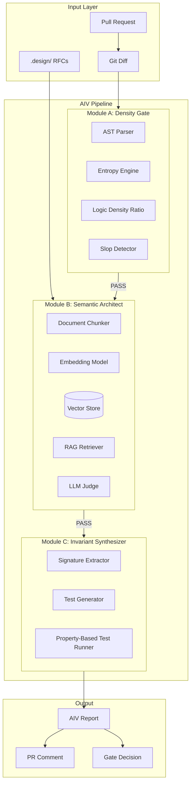

---

## 2. Detailed Component Flow

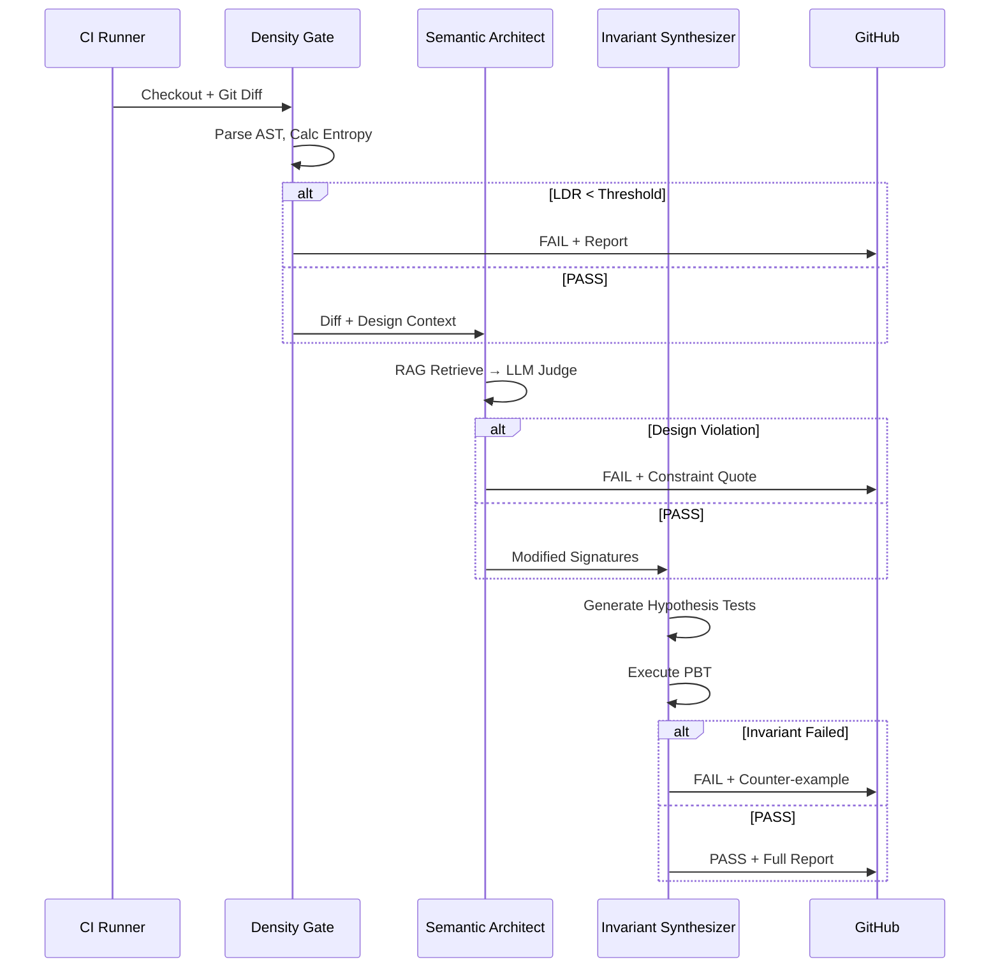

---

## 3. Technology Options by Module

### Module A: Density Gate (Local, No API)

| Category | Technology | Pros | Cons |
|----------|------------|------|------|
| **AST Parsing** | Python `ast` | Built-in, fast | Python only |
| | `tree-sitter` | Multi-language, incremental | Heavier dependency |
| | `javalang` | Java/Scala | Limited language support |
| | `antlr4` | Universal grammars | Complex setup |
| **Entropy** | `scipy.stats.entropy` | Battle-tested | — |
| | Custom Shannon (math) | No deps | Reinventing wheel |
| **Metrics** | `radon` (cyclomatic complexity) | Python complexity | Python only |
| | `lizard` | Multi-lang, maintainability | Less AST-focused |
| **Language Support** | `tree-sitter` + grammars | Python, Java, Go, Rust, etc. | Best for polyglot |

**Recommended stack:** `ast` (Python) + `tree-sitter` (Java/Scala/Go) + `scipy` or custom entropy

---

### Module B: Semantic Architect (RAG + LLM)

| Category | Technology | Pros | Cons |
|----------|------------|------|------|
| **Embeddings** | `sentence-transformers` (all-MiniLM-L6-v2) | CPU-friendly, local, free | Lower quality than OpenAI |
| | `OpenAI text-embedding-3-small` | High quality | API cost, privacy |
| | `Cohere embed-v3` | Good quality, pricing | External API |
| | `Voyage AI` | Optimized for RAG | Newer, less adoption |
| **Vector Store** | `FAISS` (faiss-cpu) | In-memory, fast, no server | Ephemeral (JIT per run) |
| | `Chroma` | Persistent, lightweight | Overkill for JIT |
| | `Qdrant` | Production-grade | Heavier for CI |
| | `LanceDB` | Embedded, SQL-like | Newer |
| **RAG Framework** | `LangChain` | Full pipeline, integrations | Heavy, many deps |
| | `LlamaIndex` | RAG-focused, flexible | Another framework |
| | Custom (embed + cosine) | Minimal, transparent | More code |
| **LLM (Judge)** | `OpenAI GPT-4o` | Strong reasoning | Cost |
| | `Anthropic Claude 3.5` | Strong, long context | Cost |
| | `OpenAI GPT-4o-mini` | Cheaper | Slightly weaker |
| | `vLLM` + Llama 3 / Mistral | Self-hosted, private | Infra overhead |
| | `Ollama` (Llama 3) | Local, zero cost | Weaker for complex tasks |

**Recommended stack:** `sentence-transformers` + `FAISS` + `LangChain` or custom + `GPT-4o-mini` (tiered) / `vLLM` (air-gapped)

---

### Module C: Invariant Synthesizer (PBT)

| Category | Technology | Pros | Cons |
|----------|------------|------|------|
| **Python PBT** | `Hypothesis` | Mature, shrink, strategies | Python only |
| **Java PBT** | `jqwik` | JUnit 5, property-based | Java only |
| | `quickcheck` | Classic | Older API |
| **Scala PBT** | `ScalaCheck` | Native to Scala | Scala only |
| **Go PBT** | `gopter` | Go idiomatic | Go only |
| **Test Runner** | `pytest` | Python standard | — |
| | `JUnit 5` | Java standard | — |
| **LLM for Synthesis** | `GPT-4o` / `Claude 3.5` | Best at invariants | Cost |
| | `CodeLlama` / `StarCoder` | Code-specialized | Weaker reasoning |

**Recommended stack:** `Hypothesis` + `pytest` (Python) / `jqwik` (Java) + `GPT-4o` or `Claude 3.5` for synthesis

---

## 4. CI/CD Integration Ease

**Design goal:** Connect to any CI/CD or Git pipeline with minimal effort.

### Why It's Easy

| Factor | How AIV Enables It |
|--------|---------------------|
| **Single entry point** | One CLI: `aiv run` or `mvn exec:java -Dexec.mainClass=...` |
| **Standard inputs** | Git workspace + diff (base ref, head ref) — every CI has this |
| **Standard outputs** | Exit code (0=pass, 1=fail), JUnit XML, JSON report |
| **No runtime deps** | Default mode: no API keys, no external services |
| **Docker-first** | `apache/aiv-gate:latest` — runs anywhere Docker runs |
| **Config in repo** | `.aiv/config.yaml` — no CI-specific wiring |
| **Adapter SPI** | New platforms: implement `ReportPublisher` / `CICDAdapter` |

### Integration Effort by Platform

| Platform | Effort | Steps |
|----------|--------|-------|
| **GitHub Actions** | ~5 min | Add workflow file, 1 job, checkout + run |
| **Jenkins** | ~5 min | Add stage, Docker agent or native |
| **GitLab CI** | ~5 min | Add job to `.gitlab-ci.yml` |
| **Azure Pipelines** | ~5 min | Add task/step |
| **CircleCI** | ~5 min | Add job to config |
| **Travis CI** | ~5 min | Add script step |
| **Buildkite** | ~5 min | Add command step |
| **Bitbucket Pipelines** | ~5 min | Add step in `bitbucket-pipelines.yml` |

### Universal Integration Pattern

```yaml
# Pattern: Checkout → Run AIV → Fail build on non-zero exit
- checkout
- run: aiv run --diff origin/$BASE_REF
# Exit code propagates; CI fails build automatically
```

### Apache infrastructure-actions: 3-Line Opt-In

Projects can use the AIV action from `apache/infrastructure-actions`:

```yaml
jobs:
  aiv:
    uses: apache/infrastructure-actions/.github/workflows/aiv.yml@main
```

Or as a composite action step:

```yaml
- uses: actions/checkout@v4
  with:
    fetch-depth: 0
- uses: apache/infrastructure-actions/aiv@main
  with:
    base-ref: origin/${{ github.base_ref }}
```

See `infrastructure-actions/aiv/README.md` for full docs.

### Copy-Paste Snippets by Platform

<details>
<summary><b>GitHub Actions</b></summary>

```yaml
- uses: actions/checkout@v4
  with:
    fetch-depth: 0
- run: docker run -v $PWD:/workspace apache/aiv-gate aiv run --workspace /workspace --diff origin/${{ github.base_ref }}
```

</details>

<details>
<summary><b>GitLab CI</b></summary>

```yaml
aiv:
  image: apache/aiv-gate:latest
  script:
    - aiv run --diff origin/$CI_MERGE_REQUEST_TARGET_BRANCH_NAME
```

</details>

<details>
<summary><b>Azure Pipelines</b></summary>

```yaml
- script: docker run -v $(Build.SourcesDirectory):/workspace apache/aiv-gate aiv run --workspace /workspace --diff origin/$(System.PullRequest.TargetBranch)
  displayName: AIV Gate
```

</details>

<details>
<summary><b>Jenkins (declarative)</b></summary>

```groovy
stage('AIV') {
  steps {
    sh 'docker run -v ${WORKSPACE}:/workspace apache/aiv-gate aiv run --workspace /workspace --diff origin/${CHANGE_TARGET}'
  }
}
```

</details>

---

## 5. CI/CD Integration Options (Platform Details)

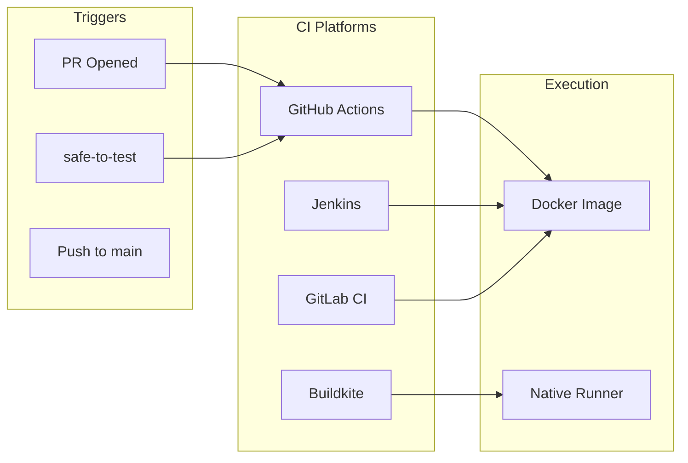

| Platform | Integration | Notes |
|----------|-------------|-------|
| **GitHub Actions** | `pull_request_target` + `workflow_run` | Two-stage for fork security |
| **Jenkins** | Docker agent `apache/aiv-gate` | ASF standard |
| **GitLab CI** | `.gitlab-ci.yml` stage | Similar to GHA |
| **Buildkite** | Plugin or script | Flexible |

---

## 6. Data Flow Diagram

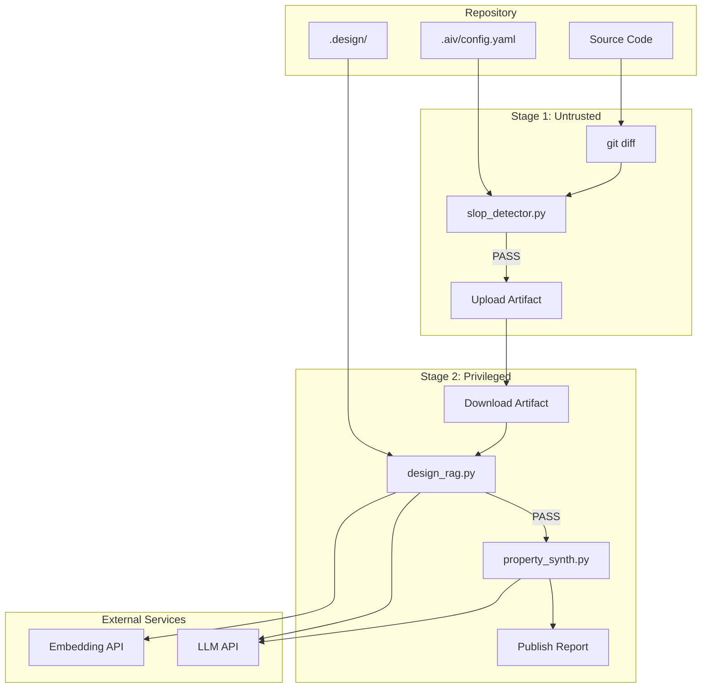

---

## 7. Alternative Architectures (Brainstorm)

### Option A: Monolithic Script
Single Python script, all modules in one process. Simpler deployment, harder to scale.

### Option B: Microservices
Each module as a container. Better for large projects, more orchestration.

### Option C: Plugin Architecture
Core orchestrator + pluggable modules. Projects choose which gates to enable.

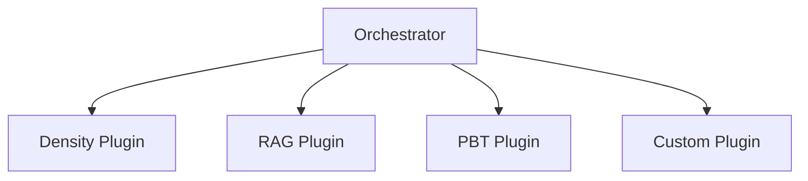

### Option D: GitHub App
Dedicated app that receives webhooks, runs AIV, posts checks. No CI config in repo.

---

## 8. Loosely-Coupled Architecture (Future-Proof Design)

Design principles: **loose coupling**, **high cohesion**, **open for extension, closed for modification**.

### 8.1 Layered Architecture with Clear Boundaries

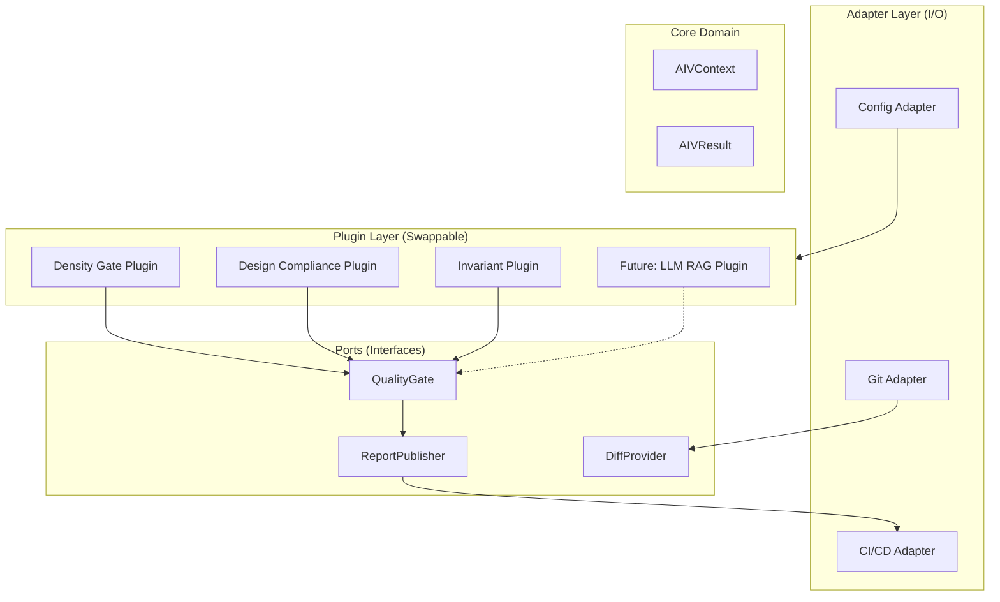

### 8.2 Contract-First Design (Ports & Adapters)

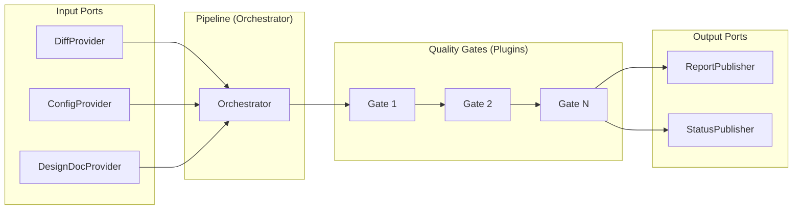

**Key contracts (interfaces):**

| Port | Interface | Responsibility |
|------|-----------|----------------|
| `DiffProvider` | `List<ChangedFile> getChangedFiles(Ref base, Ref head)` | Git diff abstraction |
| `QualityGate` | `GateResult evaluate(AIVContext ctx)` | Single gate evaluation |
| `ReportPublisher` | `void publish(AIVResult result)` | Output to CI/GitHub |
| `ConfigProvider` | `AIVConfig getConfig()` | Thresholds, rules, enable/disable |

### 8.3 Plugin Registry & Discovery

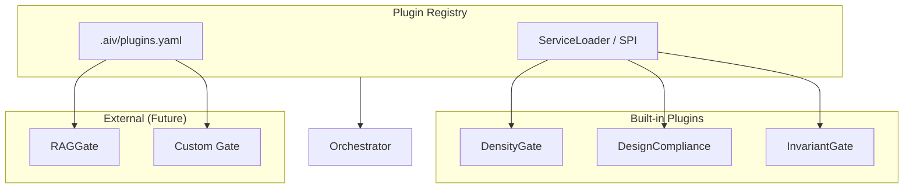

### 8.4 Data Flow: Immutable Context & Result

```mermaid
flowchart LR
    subgraph Context["AIVContext (Immutable)"]
        C1[workspace: Path]
        C2[diff: Diff]
        C3[config: Config]
        C4[metadata: Map]
    end

    subgraph Gate1["Gate A"]
        G1In[Context]
        G1Out[GateResult]
    end

    subgraph Gate2["Gate B"]
        G2In[Context + Gate A metadata]
        G2Out[GateResult]
    end

    subgraph Result["AIVResult (Accumulated)"]
        R1[gateResults: List]
        R2[overall: PASS/FAIL]
        R3[report: Report]
    end

    Context --> G1In
    G1In --> G1Out
    G1Out --> G2In
    G2In --> G2Out
    G2Out --> Result
```

**Design choice:** Each gate receives the same `AIVContext`; gates do not call each other. Orchestrator decides order and short-circuit.

### 8.5 Extension Points for Future Enhancement

| Extension Point | Today | Future Enhancement |
|-----------------|-------|--------------------|
| **Language support** | JavaParser (Java) | `ASTProvider` SPI → add Python (tree-sitter), Go, Rust |
| **Design validation** | Lucene + YAML rules | `DesignValidator` SPI → swap in RAG + LLM when budget allows |
| **Test synthesis** | jqwik templates | `InvariantGenerator` SPI → LLM synthesis, mutation templates |
| **Output format** | JUnit XML, GitHub comment | `ReportPublisher` SPI → Slack, Jira, custom dashboards |
| **CI platform** | Jenkins, GHA | `CICDAdapter` SPI → GitLab, Buildkite, Azure DevOps |
| **Metrics** | LDR, entropy, cyclomatic | `MetricCalculator` SPI → custom project metrics |

### 8.6 Module Dependency Graph (Loose Coupling)

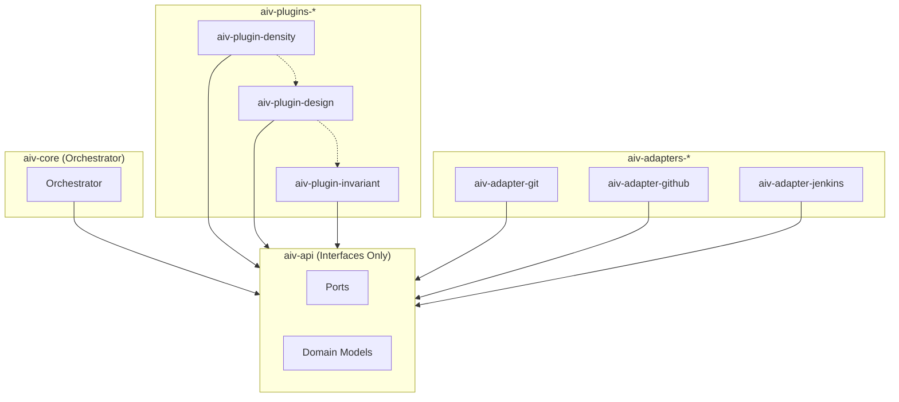

**Rule:** Plugins depend only on `aiv-api`. Plugins do not depend on each other. Adapters are swappable.

### 8.7 Maven Module Structure (Loose Coupling)

```
aiv-gate/
├── aiv-api/                    # Interfaces, models, SPI — ZERO impl deps
│   ├── QualityGate.java
│   ├── DiffProvider.java
│   ├── ReportPublisher.java
│   ├── AIVContext.java
│   └── META-INF/services/
├── aiv-core/                   # Orchestrator only
│   └── depends on: aiv-api
├── aiv-plugin-density/         # Optional
│   └── depends on: aiv-api
├── aiv-plugin-design/          # Optional
│   └── depends on: aiv-api
├── aiv-plugin-invariant/       # Optional
│   └── depends on: aiv-api
├── aiv-adapter-git/            # Optional
│   └── depends on: aiv-api
├── aiv-adapter-github/         # Optional
│   └── depends on: aiv-api
└── aiv-cli/                    # Wiring
    └── depends on: aiv-core + chosen plugins + chosen adapters
```

### 8.8 Future Enhancement Roadmap

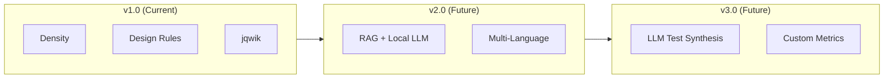

| Version | Enhancement | Coupling Impact |
|---------|-------------|-----------------|
| v1.0 | Density, Design (rules), Invariant (templates) | Add plugins, no core change |
| v2.0 | RAG plugin (Ollama), Python/Go support | New plugin, new `ASTProvider` impl |
| v3.0 | LLM synthesis, custom metric SPI | New plugin, new interface impl |

### 8.9 Configuration-Driven Gate Selection

```yaml
# .aiv/config.yaml — enables/disables without code change
gates:
  - id: density
    enabled: true
    config:
      ldr_threshold: 0.25
      entropy_threshold: 3.8
  - id: design
    enabled: true
    config:
      rules_path: .aiv/design-rules.yaml
  - id: invariant
    enabled: true
    config:
      strategy: template  # future: llm_synthesis
```

### 8.10 Dual Mode: Default Free vs Optional Paid

**Principle:** Default is 100% free (Lucene + rules). Users can optionally add paid LLM/RAG via plugins.

```mermaid
flowchart TB
    subgraph Default["Default (No Cost)"]
        Lucene[Lucene BM25]
        YAMLRules[YAML Design Rules]
        jqwik[jqwik Templates]
    end

    subgraph Optional["Optional (User Adds)"]
        RAG[RAG + Embeddings]
        LLM[LLM Judge]
        LLMSynth[LLM Test Synthesis]
    end

    subgraph Config["Config Selects"]
        Mode[design.mode: lucene | rag]
        Provider[design.provider: null | openai | anthropic]
    end

    Config --> Default
    Config --> Optional
    Default --> Result[Gate Result]
    Optional --> Result
```

| Gate | Default (Free) | Optional (Paid) |
|------|----------------|-----------------|
| **Design Compliance** | Lucene BM25 + YAML rules | RAG (embeddings) + LLM judge (OpenAI, Anthropic, etc.) |
| **Invariant Synthesis** | jqwik template-based | LLM-generated tests (GPT-4, Claude) |

**Config examples:**

```yaml
# .aiv/config.yaml — DEFAULT: 100% free, no API keys
design:
  mode: lucene
  rules_path: .aiv/design-rules.yaml

invariant:
  strategy: template
```

```yaml
# .aiv/config.yaml — OPTIONAL: User adds paid LLM/RAG
design:
  mode: rag
  provider: openai
  embedding_model: text-embedding-3-small
  judge_model: gpt-4o-mini
  # Requires: OPENAI_API_KEY in env

invariant:
  strategy: llm_synthesis
  provider: openai
  model: gpt-4o
  # Requires: OPENAI_API_KEY in env
```

**Plugin selection:**

| Maven Artifact | Default | When to Add |
|----------------|---------|-------------|
| `aiv-plugin-design-lucene` | Included | Always (free) |
| `aiv-plugin-design-rag` | Optional | Add dep + config when user wants RAG |
| `aiv-plugin-invariant-template` | Included | Always (free) |
| `aiv-plugin-invariant-llm` | Optional | Add dep + config when user wants LLM synthesis |

**CI behavior:**
- **Default:** No secrets required. Runs in any context (fork PRs, Jenkins, GHA).
- **Optional:** Requires `OPENAI_API_KEY` (or similar) in secrets. Use `pull_request_target` or privileged Jenkins only when RAG/LLM plugins are enabled.

---

## 9. Technology Decision Matrix

| Criterion | Module A | Module B | Module C |
|-----------|-----------|----------|----------|
| **Must run without secrets** | Yes | No | No |
| **Latency budget** | < 30s | < 2 min | < 5 min |
| **Cost sensitivity** | $0 | Medium | High |
| **Privacy (air-gap)** | N/A | Local embeddings + local LLM | Local LLM |
| **Multi-language** | tree-sitter | Language-agnostic | Per-language PBT lib |

---

## 10. Quick Reference: Full Stack Options

### Minimal (Low Cost, Local)
- **A:** `ast` + `scipy` (Python only)
- **B:** `sentence-transformers` + `FAISS` + `Ollama` (Llama 3)
- **C:** `Hypothesis` + `pytest` + `Ollama` for synthesis

### Balanced (ASF Default)
- **A:** `ast` + `tree-sitter` + `scipy`
- **B:** `sentence-transformers` + `FAISS` + `GPT-4o-mini`
- **C:** `Hypothesis` + `pytest` + `GPT-4o` for synthesis

### Enterprise (High Quality, Cost-Optimized)
- **A:** `tree-sitter` (all langs) + custom metrics
- **B:** `OpenAI embeddings` + `FAISS` + `Claude 3.5` (tiered: cheap for retrieval, strong for verdict)
- **C:** `Hypothesis` / `jqwik` + `Claude 3.5` for synthesis, with caching

---

## 11. Open Questions for Brainstorm

1. **Baseline calibration:** How to compute "gold standard" LDR from PMC commits? Per-project or global?
2. **Design doc format:** Standardize `.design/` structure across Apache projects?
3. **Java/Scala AST:** `javalang` vs `antlr4` vs `tree-sitter` for Spark/Iceberg?
4. **Cost ceiling:** Per-PR budget? Monthly cap per project?
5. **False positive handling:** Human override workflow, appeal process?
6. **Adversarial hardening:** How to prevent gaming of entropy/LDR metrics?

---

## 12. Java-Based Free Stack (No Paid Services)

**Constraints:** Java implementation, Apache Jenkins + GitHub CI/CD, zero paid APIs.

### 12.1 Architecture: 100% Free Quality Gate

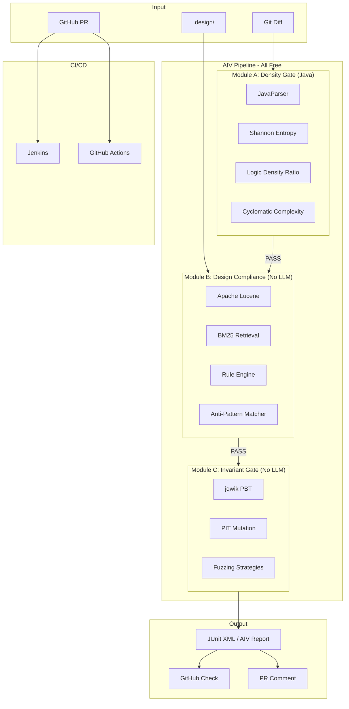

### 12.2 Technology Stack (Zero Cost)

| Module | Technology | License | Purpose |
|--------|------------|---------|---------|
| **A: Density** | **JavaParser** | Apache 2.0 | AST for Java/Scala |
| | **javaparser** (com.github.javaparser) | Apache 2.0 | Full Java 17+ AST |
| | Custom Shannon entropy | — | No deps |
| | **Metrics** (org.sonarsource) or **CK** | LGPL / MIT | Cyclomatic complexity, LDR |
| **B: Design** | **Apache Lucene** | Apache 2.0 | Full-text + vector-like search |
| | **BM25** (Lucene built-in) | — | Design doc retrieval |
| | **YAML/JSON config** | — | Rule-based constraint matching |
| | **Regex + keyword** | — | Anti-pattern detection |
| **C: Invariant** | **jqwik** | Apache 2.0 | Property-based testing |
| | **PIT** (Mutation testing) | Apache 2.0 | Mutation coverage |
| | **JUnit 5** | EPL 2.0 | Test execution |

### 12.3 Dual Mode: Free Default + Optional Paid

| Component | Default (Free) | Optional (User Adds) |
|------------|----------------|----------------------|
| **Design validation** | Lucene BM25 + YAML rules | RAG + LLM (OpenAI, Anthropic, Ollama) |
| **Invariant synthesis** | jqwik templates | LLM-generated tests |
| **Secrets required** | None | `OPENAI_API_KEY` etc. |
| **Config** | `design.mode: lucene` | `design.mode: rag` + provider |

See **Section 8.10** for full dual-mode design.

### 12.4 Quality Judgment Without LLMs (Default Mode)

| Original (LLM) | Free Alternative | How It Works |
|----------------|------------------|--------------|
| RAG + LLM Judge | **Lucene BM25 + Rule Engine** | Index `.design/` docs; retrieve top-K chunks by diff keywords; match against YAML-defined constraints (e.g., "MUST use ExpireSnapshots API") |
| LLM test synthesis | **Template-based + jqwik** | Predefined invariant templates per method signature; jqwik generates inputs; no LLM needed |
| Semantic design check | **Anti-pattern + Forbidden API** | `.design/anti-patterns.md` → parsed into rules; forbidden API list (e.g., `java.io.Serializable`); AST pattern matching |

**Rule-based design compliance example:**

```yaml
# .aiv/design-rules.yaml
constraints:
  - id: snapshot-expiration
    doc: docs/core/snapshot-expiration.md
    keywords: [ExpireSnapshots, expireSnapshots, snapshot expiration]
    forbidden_calls: [table.removeSnapshots, list.remove]
    required_calls: [ExpireSnapshots]
```

### 12.5 Apache Jenkins + GitHub Integration

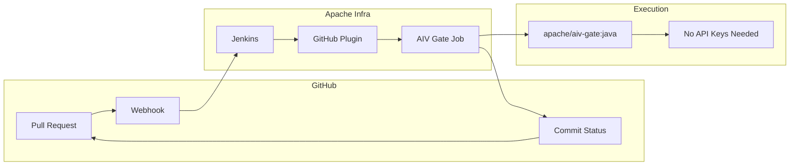

**Why no GitHub issues:**
- Jenkins receives webhooks from GitHub (standard ASF setup)
- AIV runs in Jenkins; no `pull_request_target` or fork secrets
- All logic is local → no secrets required
- GitHub Checks API via `GITHUB_TOKEN` (Jenkins credential) for status + comments

### 12.6 Jenkinsfile (Apache-Compatible)

```groovy
// Jenkinsfile - runs on every PR
pipeline {
    agent {
        docker {
            image 'eclipse-temurin:21-jdk'
            args '-v /tmp:/tmp'
        }
    }
    environment {
        // No paid API keys - all free
        AIV_CONFIG = '.aiv/config.yaml'
    }
    stages {
        stage('Checkout') {
            steps {
                checkout scm
                sh 'git fetch origin $CHANGE_TARGET && git diff origin/$CHANGE_TARGET...HEAD --name-only > changed_files.txt'
            }
        }
        stage('AIV Density Gate') {
            steps {
                sh 'mvn -q -pl aiv-core exec:java -Dexec.mainClass="org.apache.aiv.DensityGate" -Dexec.args="changed_files.txt"'
            }
        }
        stage('AIV Design Compliance') {
            when { expression { fileExists('.design/') } }
            steps {
                sh 'mvn -q -pl aiv-core exec:java -Dexec.mainClass="org.apache.aiv.DesignCompliance" -Dexec.args="changed_files.txt"'
            }
        }
        stage('AIV Invariant Check') {
            steps {
                sh 'mvn -q test -Dtest=AIVInvariantTest -DfailIfNoTests=false'
            }
        }
    }
    post {
        always {
            githubNotify status: currentBuild.result ?: 'SUCCESS'
        }
    }
}
```

### 12.7 GitHub Actions (Optional, for Projects Using GHA)

For Apache projects that use GitHub Actions alongside Jenkins:

```yaml
# .github/workflows/aiv-gate.yml
# No secrets needed - 100% local
name: AIV Gate (Free)

on:
  pull_request:
    branches: [main, master]

jobs:
  aiv:
    runs-on: ubuntu-latest
    permissions:
      contents: read
      pull-requests: write
    steps:
      - uses: actions/checkout@v4
        with:
          fetch-depth: 0

      - uses: actions/setup-java@v4
        with:
          distribution: 'temurin'
          java-version: '21'

      - name: Run AIV
        run: |
          mvn -q -pl aiv-core exec:java -Dexec.mainClass="org.apache.aiv.Main" \
            -Dexec.args="--diff origin/${{ github.event.pull_request.base.ref }}"

      - name: Report
        if: always()
        uses: actions/github-script@v7
        with:
          script: |
            const fs = require('fs');
            const report = fs.existsSync('aiv-report.json') 
              ? fs.readFileSync('aiv-report.json', 'utf8') 
              : '{}';
            github.rest.issues.createComment({
              owner: context.repo.owner,
              repo: context.repo.repo,
              issue_number: context.issue.number,
              body: `## AIV Report\n\`\`\`json\n${report}\n\`\`\``
            });
```

**Fork safety:** No `pull_request_target` needed; no secrets; workflow runs in fork context but only reads code (no write to base repo from fork).

### 12.8 Quality Metrics Summary (Free Stack)

| Metric | Source | Threshold |
|--------|--------|-----------|
| **Logic Density Ratio** | AST (control/transform vs structure) | > 0.25 |
| **Shannon Entropy** | Source text | > 3.8 |
| **Cyclomatic Complexity** | Per method | < 15 (configurable) |
| **Docstring/Code Ratio** | AST | < 0.5 (avoid filler docs) |
| **Design Constraint** | Lucene + rules | Must match `.aiv/design-rules.yaml` |
| **Mutation Score** | PIT (optional) | > 70% |
| **jqwik Properties** | Template invariants | All pass |

### 12.9 Maven Module Layout

Aligned with Section 8 (loosely-coupled). **Default = free plugins only.** Optional paid plugins are separate artifacts.

```
aiv-gate/
├── pom.xml
├── aiv-api/                      # Interfaces, models, SPI
├── aiv-core/                     # Orchestrator
├── aiv-plugin-density/           # Default (free)
├── aiv-plugin-design-lucene/     # Default (free) — Lucene + YAML rules
├── aiv-plugin-design-rag/        # Optional (paid) — RAG + LLM judge
├── aiv-plugin-invariant-template/# Default (free) — jqwik templates
├── aiv-plugin-invariant-llm/      # Optional (paid) — LLM test synthesis
├── aiv-adapter-git/
├── aiv-adapter-github/
├── aiv-cli/                      # Wiring — default deps = free plugins only
└── .aiv/
    └── config.yaml
```

**Dependency choice:** `aiv-cli` default `pom.xml` includes only free plugins. Users add `aiv-plugin-design-rag` and `aiv-plugin-invariant-llm` when they want paid LLM/RAG.

### 12.10 Dependencies (pom.xml snippet)

```xml
<dependencies>
    <!-- AST -->
    <dependency>
        <groupId>com.github.javaparser</groupId>
        <artifactId>javaparser-symbol-solver-core</artifactId>
        <version>3.25.7</version>
    </dependency>
    <!-- Design doc search -->
    <dependency>
        <groupId>org.apache.lucene</groupId>
        <artifactId>lucene-core</artifactId>
        <version>9.11.0</version>
    </dependency>
    <!-- PBT -->
    <dependency>
        <groupId>net.jqwik</groupId>
        <artifactId>jqwik</artifactId>
        <version>1.8.3</version>
        <scope>test</scope>
    </dependency>
    <!-- Optional: mutation testing -->
    <dependency>
        <groupId>org.pitest</groupId>
        <artifactId>pitest-junit5-plugin</artifactId>
        <version>1.2.1</version>
        <scope>test</scope>
    </dependency>
</dependencies>
```

---

*Document for brainstorming — not final specification.*
