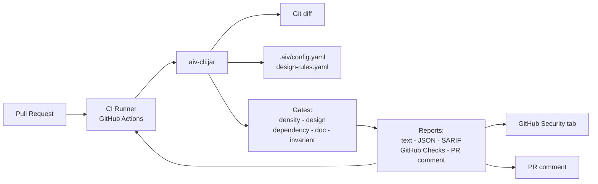
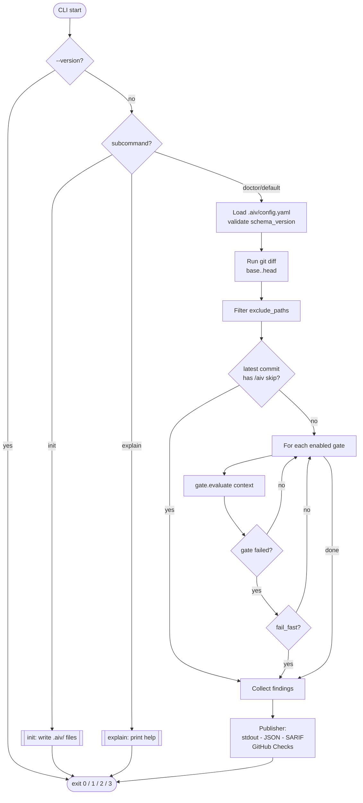
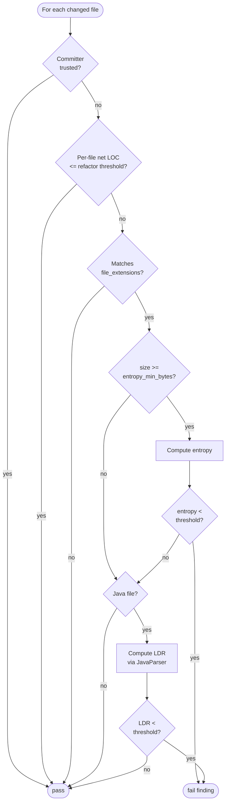
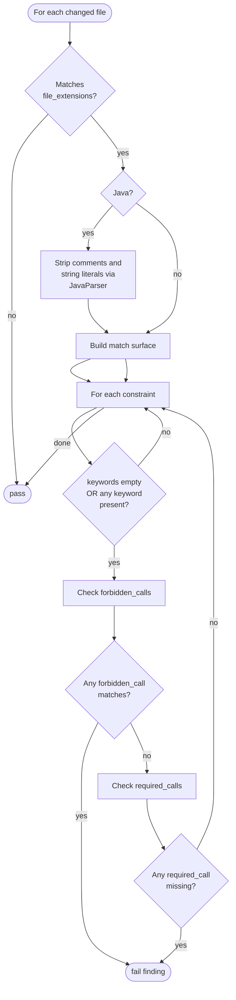
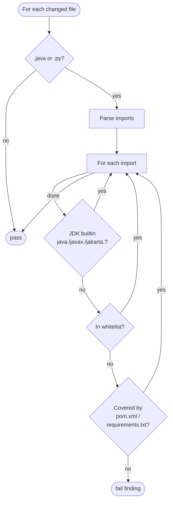
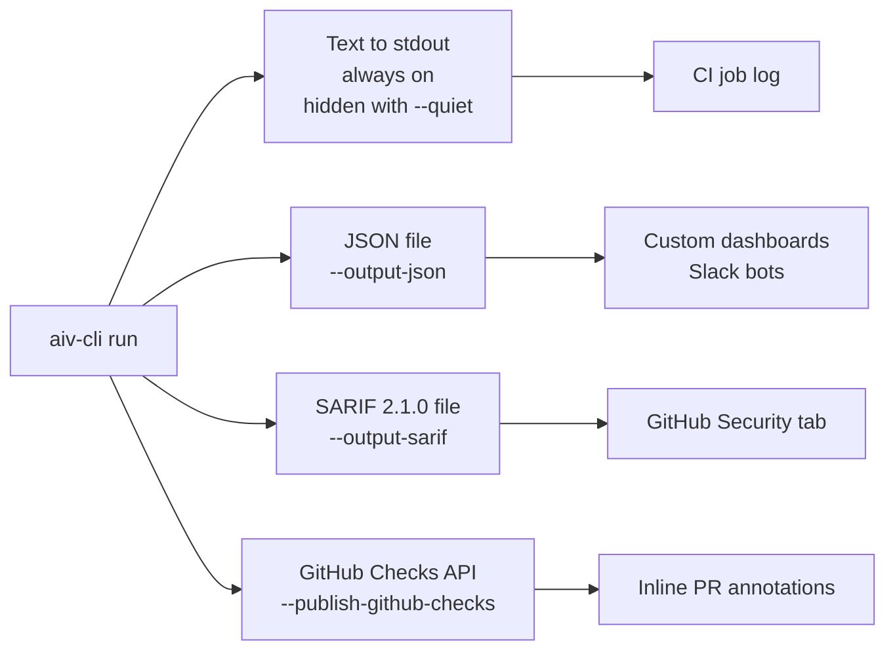
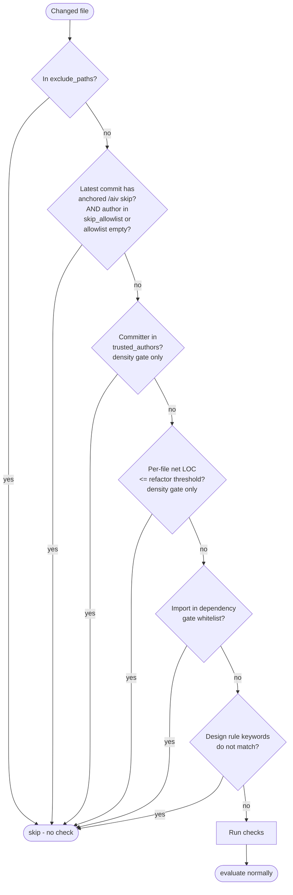
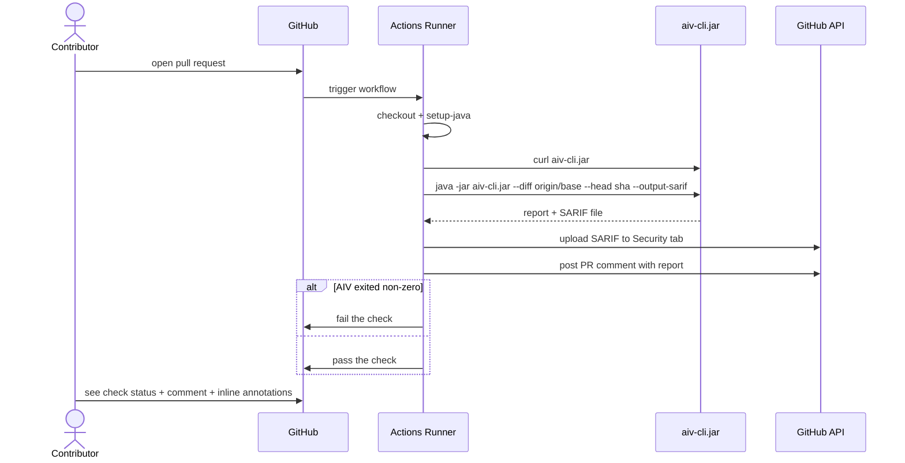
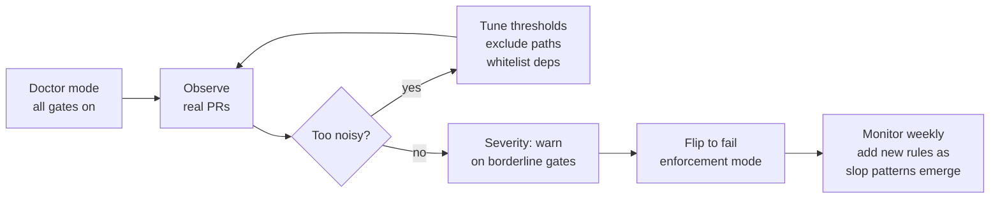

# AIV Integrity Gate - Complete Tutorial

## Table of Contents

1. [The Problem](#1-the-problem)
2. [How AIV Solves It](#2-how-aiv-solves-it)
3. [Complete Feature List](#3-complete-feature-list)
4. [Installation](#4-installation)
5. [The Five Gates - Deep Dive](#5-the-five-gates-deep-dive)
 - 5.1 Density Gate
 - 5.2 Design Gate
 - 5.3 Dependency Gate
 - 5.4 Doc Integrity Gate
 - 5.5 Invariant Gate
6. [CLI Commands](#6-cli-commands)
7. [CLI Flags - Complete Reference](#7-cli-flags-complete-reference)
8. [Config Files - Complete Reference](#8-config-files-complete-reference)
9. [Output Formats](#9-output-formats)
10. [Overrides and Exemptions](#10-overrides-and-exemptions)
11. [End-to-End Walkthrough](#11-end-to-end-walkthrough)
12. [GitHub Actions Integration](#12-github-actions-integration)
13. [Tuning for Your Repo](#13-tuning-for-your-repo)
14. [Troubleshooting](#14-troubleshooting)
15. [Conclusion](#15-conclusion)

---

## 1. The Problem

Pull-request review is expensive and doesn't scale. Two forces are making it worse:

- **AI-assisted code generation.** Contributors paste LLM output into PRs. Some is good. Some is scaffolding with no real logic, comments like "Generated by ChatGPT", emoji decorations, or hallucinated imports.
- **Low-effort contributions.** Empty classes, pure getter/setter POJOs, copy-paste with minor renaming. Looks like work; wastes reviewer time.

Concrete consequences reviewers hit every day:

- PRs that look busy at a glance but add nothing substantive.
- Project rules (no `System.exit`, use the sanctioned API, don't use deprecated methods) relying on reviewers to catch manually.
- Docs merged with broken markdown links and references to files that don't exist.
- Imports that aren't in `pom.xml` or `requirements.txt` slipping through.

The existing tools don't cover this gap cleanly:

- PMD, Checkstyle, SonarQube - whole-repo Java static analyzers. Not PR-scoped. Not framed around AI tells.
- Semgrep - great multi-language pattern tool, but you author your own rules and it's not positioned for this use case.
- Dependabot, Snyk - dependency security. Narrow focus.
- markdown-link-check, lychee - markdown only.

You end up wiring five tools with five configs to cover what AIV does in one.

## 2. How AIV Solves It

### 2.1 Architecture at a glance



AIV Integrity Gate is a single Java program that runs on the diff of a pull request. Key properties:

- **Diff-scoped.** Only looks at files changed in the PR. Predictable runtime, no noise on legacy code.
- **Deterministic.** No LLM calls. Same input always produces the same output.
- **Zero-network runtime.** No API keys, no cloud accounts, no data leaves your CI.
- **Single jar.** One `aiv-cli.jar` (about 7 MB). Download and run.
- **One config for everything.** `.aiv/config.yaml` enables/disables gates and sets thresholds. `.aiv/design-rules.yaml` holds your project-specific rules.
- **Native GitHub integration.** Emits SARIF for the Security tab, posts inline Check annotations on the PR diff, and/or leaves a PR comment.

What AIV is not:

- Not a replacement for PMD/Semgrep. Those are whole-repo analyzers.
- Not a security scanner (no CVE lookup, no secret scanning) - yet.
- Not a formatter, linter, or test runner.

### 2.2 Gate execution pipeline



## 3. Complete Feature List

Five gates:

| Gate | What it catches | Languages |
|---|---|---|
| **density** | Pure POJOs, empty scaffolding, repetitive boilerplate. | Java (deep LDR), others (entropy) |
| **design** | Forbidden patterns: `System.exit`, emoji, AI-markers, architecture rules. | Multi-language (Java gets comment-aware matching) |
| **dependency** | Imports not declared in `pom.xml` or `requirements.txt`. | Java, Python |
| **doc-integrity** | Broken markdown links, fabricated paths in prose, cross-reference checks. | Markdown, RST, text |
| **invariant** | Extension point (template stub). | - |

Three top-level commands:

| Command | Purpose |
|---|---|
| `init` | Write starter `.aiv/config.yaml` and `.aiv/design-rules.yaml` with language detection. |
| `doctor` | Run gates in advisory mode - always exits 0 regardless of findings. |
| `explain` | Show in-CLI documentation for a gate. |

Supporting commands / modes:

- **Default gate run.** No subcommand, just flags. Runs all enabled gates and fails the build on violations.
- **Gate advisory mode.** `--doctor` as a flag achieves the same result as the `doctor` subcommand.

Gate execution behaviors:

- **Diff scoping.** Every gate runs only against changed files.
- **Fail aggregation.** By default all gates run and all failures are reported. Set `fail_fast: true` to stop at first failure.
- **Per-gate severity.** A gate can be configured as `severity: fail` (default) or `severity: warn` - `warn` reports the violation but does not block CI.
- **Exit code contract.** Machine-readable: 0 pass, 1 fail, 2 config error, 3 git subprocess failure.
- **Warnings exit code.** `--warnings-exit-code N` lets CI branch differently when a run passed but emitted notices (e.g. large file skipped).

Output formats:

- **Text report to stdout.** Default. Human-readable.
- **JSON report.** `--output-json <path>`, `schema_version: 2`, findings with file/line/rule_id.
- **SARIF 2.1.0.** `--output-sarif <path>`, drops into GitHub Code Scanning / Security tab.
- **GitHub Checks annotations.** `--publish-github-checks` posts inline annotations on the PR diff (max 50).
- **PR comment.** Via workflow step (not native to the CLI).

Overrides and exemptions:

- **`/aiv skip`.** Put it on its own line in the latest commit message - AIV reports PASS with a skip notice. Anchored match; substring in prose does not trigger.
- **`skip_allowlist`.** Restrict who can use `/aiv skip` by author email.
- **`exclude_paths`.** Glob patterns (`**/generated/**`, `docs/**`) ignored by all gates.
- **Refactor exemption.** Files with net LOC <= threshold (default -50) skip the density check. Per-file, not whole-run.
- **Trusted authors.** Listed emails bypass the density gate.
- **Dependency whitelist.** Explicit package prefixes accepted by the dependency gate.
- **Design rule keywords.** A constraint only applies to files whose content or path contains any of its `keywords`. Empty list = apply everywhere.

Config schema:

- **`schema_version: 1`.** Required top-level key. AIV validates it and warns on mismatch.
- **YAML safe loader.** SnakeYAML with `SafeConstructor` - no deserialization exploits.

Reporting polish:

- **Doctor mode labeling.** Report header reads `=== AIV Report (DOCTOR) ===`, JSON/SARIF carry `doctor_mode: true`.
- **Notices.** Warnings like "file skipped (exceeds 2 MB)" surface as `WARN:` lines.
- **`--quiet` flag.** Suppress stdout report; useful for pre-commit hooks.
- **Per-gate status.** Each gate reports PASS / FAIL / ADVISORY (warn-severity) individually.

Security and safety:

- **Git ref validation.** Regex-anchored `^[a-zA-Z0-9/_.~^-]+$` to prevent injection.
- **Subprocess timeouts.** Configurable via `-Daiv.git.timeout.seconds=...` JVM property.
- **Output size caps.** Git subprocess output limited (default 64 MB) via `-Daiv.git.capture.max.bytes=...`.
- **File size cap.** Per-file read cap at 2 MB; files over limit emit a warning notice.
- **Path traversal protection.** All file reads validated to be under the workspace root.
- **Disabled git pager and terminal prompts.** `GIT_TERMINAL_PROMPT=0`, `GIT_PAGER=cat`.

Installation and packaging:

- **Shaded uber JAR.** One ~7 MB file, all dependencies bundled.
- **GitHub Release asset.** Attached to every tagged release; release workflow verifies the jar contains `Main.class` and `org/slf4j/` before upload.
- **Maven Central artifact.** `io.github.vaquarkhan:aiv-cli:1.0.4`.
- **Composite GitHub Action.** `vaquarkhan/aiv-integrity-gate@v1` downloads the jar and runs it. See Part 12.

Testing and build:

- **100% JaCoCo line coverage enforced** on every module.
- **About 40 test classes** covering gates, adapters, and CLI.

Documentation:

- **`aiv explain <gate>`** - built-in docs for each gate (density, design, dependency, doc-integrity, invariant).
- **Informative errors.** Every gate failure includes rule id, file path, line number, and a pointer to config docs.

Roadmap items NOT in this version (openly disclosed in README):

- **`aiv-plugin-security`** - secrets, CVE, Semgrep integration.
- **`--baseline`** - suppress pre-existing violations for gradual adoption.
- **Labeled precision/recall benchmark.**

Everything up to the Roadmap heading is shipping today in 1.0.4.

## 4. Installation

### 4.1 Prerequisites

- **Java 17 or newer.** Verify with `java -version`.
- **Git.** Verify with `git --version`.

Install Java:

- **Windows.** Download the MSI from https://adoptium.net. Run it. Check "Set JAVA_HOME" during install.
- **Mac.** `brew install --cask temurin@17`
- **Linux.** `sudo apt install -y openjdk-17-jdk` (Debian/Ubuntu) or `sudo dnf install -y java-17-openjdk-devel` (Fedora/RHEL).

### 4.2 Download AIV

```bash
curl -fsSL -o aiv-cli.jar \
 https://repo1.maven.org/maven2/io/github/vaquarkhan/aiv-cli/1.0.4/aiv-cli-1.0.4.jar
```

If Maven Central doesn't have it yet, use the GitHub Release:

```bash
curl -fsSL -o aiv-cli.jar \
 https://github.com/vaquarkhan/aiv-integrity-gate/releases/download/v1.0.4/aiv-cli-1.0.4.jar
```

### 4.3 Verify

```bash
java -jar aiv-cli.jar --version
# aiv-cli 1.0.4
```

If you get `NoClassDefFoundError`, you downloaded the thin jar. Re-download and pick the 7 MB file.


## 5. The Five Gates - Deep Dive

### 5.1 Density Gate

**Purpose.** Catch code that looks like real work but has no real logic.

**Two checks:**

1. **LDR (Logic Density Ratio)** - Java only. Uses JavaParser to count:
 - Logic nodes: `if`, `for`, `while`, `switch`, method calls, binary expressions.
 - Structural nodes: class declarations, method declarations.
 - Ratio = logic / (logic + structure). Pure POJO = 0.0. Real code typically 0.4+.
2. **Shannon entropy** - any configured language. Catches extremely repetitive content. Files under `entropy_min_bytes` are skipped to avoid flagging short legitimate files.

**Skips the check when:**

- The committer email is in `trusted_authors`.
- The file's net LOC is <= `refactor_net_loc_threshold` (default -50), meaning the change is mostly deletions.



**Configuration (.aiv/config.yaml):**

```yaml
gates:
 - id: density
 enabled: true
 severity: fail # or: warn (advisory only, does not block CI)
 config:
 ldr_threshold: 0.25 # fail if Java LDR is below this
 entropy_threshold: 4.0 # fail if Shannon entropy is below this
 entropy_min_bytes: 512 # skip entropy check below this size
 refactor_net_loc_threshold: -50 # per-file: net LOC <= this exempts density
 trusted_authors: # emails that bypass the gate
 - maintainer@example.com
 - ci-bot@example.com
 file_extensions: # optional override; see section 8.2
 - ".java"
 - ".py"
```

Setting `ldr_threshold: 0.0` logs a WARN at runtime: "density gate ldr_threshold=0.0 disables logic-density blocking; set > 0 for enforcement." Useful during pilot, not for production.

**Running it:**

Part of a normal gate run:

```bash
java -jar aiv-cli.jar --workspace . --diff main --head HEAD
```

**Typical output:**

```
density: FAIL - Low logic density (0.00) in src/main/java/com/example/Pojo.java - threshold 0.25
```

or for entropy:

```
density: FAIL - Entropy 3.62 is below effective threshold 4.00 for slop.py (tune density gate entropy_threshold / entropy_min_bytes; see docs/DEVELOPER-CONFIGURATION.md).
```

**When findings are legitimate:**

DTOs, generated stubs, data classes. Either exclude their paths, add emails to `trusted_authors`, or raise thresholds.

### 5.2 Design Gate

**Purpose.** Enforce project-specific rules - forbidden APIs, required APIs, AI-slop markers, architecture constraints.

**How matching works:**

- For `.java` files: AIV parses the source with JavaParser, removes comments and string literals, then runs matching on the cleaned surface. A comment like `// never use System.exit in production` will NOT trigger a `System.exit` rule.
- For other files: token-aware regex with word-boundary lookaround. `"AI-generated"` matches `"AI-generated"` but NOT `"generated by ai doctor"` in prose.



**Configuration:**

`.aiv/config.yaml`:

```yaml
gates:
 - id: design
 enabled: true
 severity: fail
 config:
 rules_path: .aiv/design-rules.yaml
 file_extensions: # optional override
 - ".java"
 - ".py"
 - ".ts"
```

`.aiv/design-rules.yaml`:

```yaml
constraints:
 - id: no-system-exit
 keywords: [] # [] = apply to all files
 forbidden_calls: [System.exit]
 required_calls: []

 - id: no-emoji-in-code
 keywords: []
 forbidden_calls: ["", "", "", "", ""]
 required_calls: []

 - id: no-ai-generated-markers
 keywords: []
 forbidden_calls:
 - "Generated by AI"
 - "Generated by ChatGPT"
 - "Generated by Copilot"
 - "Generated by Claude"
 - "Generated by Gemini"
 - "AI-generated"
 - "Auto-generated by"
 required_calls: []

 - id: require-expire-snapshots
 keywords: [expireSnapshots, ExpireSnapshots]
 forbidden_calls: [table.removeSnapshots]
 required_calls: [ExpireSnapshots]

 - id: no-todo-in-prod-code
 keywords: ["src/main"] # only in production code paths
 forbidden_calls: ["TODO", "FIXME", "XXX"]
 required_calls: []
```

**Each constraint has:**

- `id` - unique name. Appears in reports as `design.forbidden.<id>` or `design.required.<id>`.
- `keywords` - strings. The rule only applies if the file content OR path contains any listed keyword. Empty list = always apply.
- `forbidden_calls` - strings. Fail if any appear in the code surface.
- `required_calls` - strings. Fail if any are missing (when the rule applies).

**Running it:**

```bash
java -jar aiv-cli.jar --workspace . --diff main --head HEAD
```

**Output:**

```
design: FAIL - Forbidden call 'System.exit' in src/main/java/com/example/Bad.java (constraint: no-system-exit)
```

Multiple constraint failures are joined on separate lines in one message.

### 5.3 Dependency Gate

**Purpose.** Prevent typos, unexpected imports, and imports referencing packages not listed in the project build file.

**How it works:**

1. Read `pom.xml` (`<groupId>`, `<dependency>` blocks) and/or `requirements.txt` / `pyproject.toml`.
2. Build the allowed set.
3. For each `.java` file, use JavaParser to extract `import` declarations. For each `.py` file, regex-scan `import X` and `from X import Y` lines.
4. Skip JDK imports (`java.*`, `javax.*`, `jakarta.*`).
5. For everything else, check if the import's package prefix is covered by any declared group/artifact.

The gate handles common mismatches where Maven groupId isn't the Java package root:

- `com.google.guava:guava` -> provides `com.google.common.*`
- `commons-io:commons-io` -> provides `org.apache.commons.io.*`
- `com.fasterxml.jackson.core:jackson-databind` -> provides `com.fasterxml.jackson.databind.*`
- `org.jetbrains.kotlin:kotlin-stdlib` -> provides `kotlin.*`



**Configuration:**

```yaml
gates:
 - id: dependency
 enabled: true
 severity: fail
 config:
 whitelist:
 - com.yourcompany.internal
 - org.my.private.library
 # any package prefix you trust but is not in pom.xml
```

**Running it:**

Part of a normal gate run.

**Output:**

```
dependency: FAIL - Import 'com.totally.fake.Thing' in src/main/java/com/example/Bad.java is not covered by declared dependencies (configure dependency gate whitelist if intentional)
```

### 5.4 Doc Integrity Gate

**Purpose.** Validate markdown, RST, and text documentation - broken links, fabricated paths, incomplete commands.

**Sub-checks (all run automatically when the gate is enabled):**

- **Markdown links.** `[text](target.md)` where `target.md` doesn't exist.
- **Cross-references.** Prose like "see the docs in `setup/`" where `setup/` doesn't exist.
- **Required mentions.** Doc files that must contain specific strings.
- **Command completeness.** Documented commands (e.g. `docker run`) missing required flags.
- **Path fabrication.** Any path mentioned in prose that has no match in the workspace.

**Configuration:**

`.aiv/config.yaml`:

```yaml
gates:
 - id: doc-integrity
 enabled: true
 severity: fail
 config:
 rules_path: .aiv/doc-rules.yaml
 auto: true # run only when PR touches a doc file
```

Optional `.aiv/doc-rules.yaml`:

```yaml
required_mentions:
 - file: README.md
 must_contain: ["Installation", "License"]
 - file: CONTRIBUTING.md
 must_contain: ["Code of Conduct"]

canonical_commands:
 - id: docker-rm-flag
 pattern: "docker run"
 required_flags: ["--rm"]
 required_followup: []
 required_commands: []
 - id: mvn-clean-verify
 pattern: "mvn verify"
 required_flags: []
 required_followup: []
 required_commands: ["clean"]
```

**Running it:**

Runs automatically when `auto: true` and the PR touches `.md`, `.txt`, or `.rst`. Force it on a run that doesn't naturally include doc files:

```bash
java -jar aiv-cli.jar --workspace . --diff main --head HEAD --include-doc-checks
```

**Output:**

```
doc-integrity: FAIL - Markdown link in docs/setup.md: target does not exist: install-guide-missing.md
```

Multiple findings from one doc file are reported together.

### 5.5 Invariant Gate

**Purpose.** Template stub. Passes unconditionally. Extension point for teams to wire property-based tests (jqwik, QuickCheck) into the CI gate.

**Configuration:**

```yaml
gates:
 - id: invariant
 enabled: false # default: off
```

Leave disabled unless you plan to fork and implement your own invariant checks. Future versions may ship a reference implementation.


## 6. CLI Commands

### 6.1 Default gate run

```bash
java -jar aiv-cli.jar --workspace . --diff main --head HEAD
```

Runs all enabled gates against the diff between `main` and `HEAD`. Reports to stdout. Exits 0 on pass, 1 on any failure.

### 6.2 `init` - bootstrap config files

```bash
java -jar aiv-cli.jar init --workspace .
```

Detects project languages by looking at:

- Source files (`.java`, `.py`, `.go`, `.rs`, `.ts`, `.js`, `.kt`, `.scala`, ...).
- Build files (`pom.xml`, `build.gradle`, `build.gradle.kts`, `package.json`, `requirements.txt`, `pyproject.toml`, `go.mod`, `Cargo.toml`).

Writes starter `.aiv/config.yaml` and `.aiv/design-rules.yaml` with defaults tuned for detected languages.

### 6.3 `doctor` - advisory mode

```bash
java -jar aiv-cli.jar doctor --workspace . --diff main --head HEAD
```

Runs all gates, reports findings, but **always exits 0**. Designed for piloting AIV on an existing repo without blocking merges.

The report is explicitly labeled:

```
=== AIV Report (DOCTOR) ===
Overall: PASS
WARN: [DOCTOR] Informational run: gate outcomes are reported but not CI-blocking.
 density: FAIL - Low logic density ...
 design: PASS - OK
 dependency: PASS - OK
==================
```

Equivalent to passing `--doctor` to the default run.

### 6.4 `explain` - per-gate documentation

```bash
java -jar aiv-cli.jar explain density
java -jar aiv-cli.jar explain design
java -jar aiv-cli.jar explain dependency
java -jar aiv-cli.jar explain doc-integrity
java -jar aiv-cli.jar explain invariant
```

Also accepts rule-level IDs emitted in reports (e.g. `density.ldr`, `density.entropy`, `design.forbidden.no-system-exit`) and maps them to the gate's documentation.

Unknown topics print a helpful list:

```
No embedded help for "no-system-exit".
Built-in topics: density, design, dependency, doc-integrity, invariant.
```

### 6.5 `--version` / `-V`

```bash
java -jar aiv-cli.jar --version
# aiv-cli 1.0.4
```

## 7. CLI Flags - Complete Reference

| Flag | Argument | Description |
|---|---|---|
| `--workspace <path>` | directory | Repository root. Defaults to current directory. |
| `--diff <ref>` | git ref | Base for comparison (e.g. `main`, `origin/main`, SHA). |
| `--head <ref>` | git ref | Head ref. Defaults to `HEAD`. |
| `--doctor` | flag | Same as the `doctor` subcommand. |
| `--include-doc-checks` | flag | Force-enable doc-integrity gate even if config has it disabled. |
| `--output-json <path>` | file | Write structured JSON report. Creates parent dirs. |
| `--output-sarif <path>` | file | Write SARIF 2.1.0 report. |
| `--publish-github-checks` | flag | POST inline annotations to GitHub Checks API. Requires `GITHUB_TOKEN`, `GITHUB_REPOSITORY`, and `GITHUB_SHA` or `AIV_GITHUB_HEAD_SHA` env vars. |
| `--warnings-exit-code <N>` | integer | Override exit code when the run passed but has notices. Default 0. |
| `--quiet` | flag | Suppress the stdout report. Structured outputs still emit. |
| `--version` / `-V` | flag | Print CLI version and exit 0. |

**Exit codes:**

| Code | Meaning |
|---|---|
| 0 | All gates passed, or `doctor` mode. |
| 1 | At least one gate failed. |
| 2 | Invalid configuration or arguments. |
| 3 | Git subprocess failed (bad ref, unreadable repo, timeout). |
| N | Override via `--warnings-exit-code N` when a pass happened with notices. |

**JVM system properties (optional tuning):**

| Property | Default | Purpose |
|---|---|---|
| `-Daiv.git.timeout.seconds=120` | 120 | Per-subprocess timeout. 0 means wait forever. |
| `-Daiv.git.capture.max.bytes=67108864` | 64 MB | Max bytes read from a captured git subprocess. |
| `-Daiv.git.executable=/path/to/git` | `git` on PATH | Override git executable (test use). |
| `-Daiv.github.checks.url=...` | GitHub API | Override Checks API base URL (test use). |

## 8. Config Files - Complete Reference

### 8.1 `.aiv/config.yaml`

Complete example showing every supported key:

```yaml
schema_version: 1

# Run all gates and aggregate findings (default), or stop at first failure.
fail_fast: false

# Globs skipped by every gate. Repo-relative.
exclude_paths:
 - "docs/**"
 - "example-project/**"
 - "**/generated/**"
 - "**/target/**"

# Only these committer emails may use /aiv skip on the latest commit.
# Empty/absent = any committer may use it.
skip_allowlist:
 - maintainer@example.com

gates:
 - id: density
 enabled: true
 severity: fail # fail (default) or warn
 config:
 ldr_threshold: 0.25
 entropy_threshold: 4.0
 entropy_min_bytes: 512
 refactor_net_loc_threshold: -50
 trusted_authors:
 - maintainer@example.com
 file_extensions:
 - ".java"
 - ".py"

 - id: design
 enabled: true
 severity: fail
 config:
 rules_path: .aiv/design-rules.yaml
 file_extensions:
 - ".java"
 - ".py"
 - ".ts"

 - id: dependency
 enabled: true
 severity: fail
 config:
 whitelist:
 - com.yourcompany.internal

 - id: doc-integrity
 enabled: false
 severity: fail
 config:
 rules_path: .aiv/doc-rules.yaml
 auto: true

 - id: invariant
 enabled: false
```

### 8.2 `file_extensions` - supported values

If omitted, AIV defaults to a multi-language set. Override per gate with either:

**Explicit list:**

```yaml
file_extensions:
 - ".java"
 - ".kt"
 - ".py"
 - ".go"
```

**Language aliases (resolved to extensions):**

```yaml
languages:
 - java
 - kotlin
 - python
 - go
 - rust
 - scala
 - javascript
 - typescript
 - c
 - cpp
 - ruby
 - shell
```

### 8.3 `.aiv/design-rules.yaml`

```yaml
constraints:
 - id: <unique-name>
 keywords: [] # apply always, or list keywords
 forbidden_calls: []
 required_calls: []
```

Each field explained:

- `id` - unique per-constraint identifier. Shown in reports as `design.forbidden.<id>` when a `forbidden_calls` item fires, or `design.required.<id>` when a `required_calls` item is missing.
- `keywords` - list of strings. Rule triggers only if file content OR file path contains any of these. `[]` = always trigger.
- `forbidden_calls` - list of strings. Fail if any appear in the code surface (comments/strings stripped for `.java`).
- `required_calls` - list of strings. When the rule applies (via keywords), fail if any are missing.

### 8.4 `.aiv/doc-rules.yaml`

```yaml
# Required strings in specific files
required_mentions:
 - file: README.md
 must_contain: ["Installation", "License"]

# Command completeness
canonical_commands:
 - id: docker-rm
 pattern: "docker run"
 required_flags: ["--rm"]
 required_followup: [] # strings that must appear after
 required_commands: [] # other commands that must appear
```

### 8.5 Schema validation

AIV reads `schema_version` from the top of `.aiv/config.yaml`. Current supported value is 1. Other values fall back to default handling with a warning; missing key logs INFO.


## 9. Output Formats

AIV produces up to four outputs simultaneously on a single run, each targeting a different consumer.



### 9.1 Text report (default)

```
=== AIV Report ===
Overall: FAIL
 density: PASS - OK
 design: FAIL - Forbidden call 'System.exit' in ...
 dependency: PASS - OK
==================
```

Doctor mode prefixes the header:

```
=== AIV Report (DOCTOR) ===
```

Notices (file skipped, git timeout, doctor mode) appear as `WARN:` lines.

### 9.2 JSON (`--output-json <path>`)

Structured `schema_version: 2`:

```json
{
 "schema_version": 2,
 "aiv_cli_version": "1.0.4",
 "doctor_mode": false,
 "passed": false,
 "notices": [],
 "gates": [
 {
 "id": "design",
 "passed": false,
 "blocks_ci": true,
 "message": "Forbidden call 'System.exit' ...",
 "findings": [
 {
 "rule_id": "design.forbidden.no-system-exit",
 "file": "src/main/java/com/example/Bad.java",
 "start_line": 5,
 "message": "Forbidden call 'System.exit' ..."
 }
 ]
 }
 ]
}
```

Use cases: custom dashboards, Slack bots, pipelines that pipe to `jq`.

### 9.3 SARIF (`--output-sarif <path>`)

SARIF 2.1.0 output. Upload in your workflow via `github/codeql-action/upload-sarif@v3`. Findings appear in the repo's Security tab under Code Scanning with file paths and line numbers. Run properties include `doctorMode: true|false`.

### 9.4 GitHub Checks (`--publish-github-checks`)

Posts inline annotations directly on the PR diff via the GitHub Checks API. Each finding becomes a comment next to the offending line. Capped at 50 annotations per run.

Requires env vars (set automatically in GitHub Actions):

- `GITHUB_TOKEN` - token with `checks:write` permission.
- `GITHUB_REPOSITORY` - `owner/repo` format.
- `GITHUB_SHA` or `AIV_GITHUB_HEAD_SHA` - commit being checked.

Optional `AIV_GITHUB_CHECKS_URL` or `-Daiv.github.checks.url=...` overrides the API base URL (GitHub Enterprise Server or test stubs).

## 10. Overrides and Exemptions



Each override summarized:

| Override | Scope | Where to set |
|---|---|---|
| `exclude_paths` | All gates | `.aiv/config.yaml` top-level |
| `/aiv skip` on latest commit | All gates | commit message, on its own line |
| `skip_allowlist` | Restricts `/aiv skip` | `.aiv/config.yaml` top-level |
| `trusted_authors` | Density only | density gate `config` |
| Refactor exemption | Density only, per-file | density gate `config.refactor_net_loc_threshold` |
| Dependency whitelist | Dependency only | dependency gate `config.whitelist` |
| Design rule `keywords` | Design only | constraint `keywords` list |
| Gate `severity: warn` | Per gate | gate `severity` |
| Gate `enabled: false` | Per gate | gate `enabled` |

### 10.1 `/aiv skip` rules

- Must be on its own line: `^\s*/?aiv\s+skip\s*$`.
- Must be in the **latest** commit on the PR head.
- If `skip_allowlist` is set, committer email must match.
- Prose like "documented the aiv skip workflow" does NOT trigger.

Example skip commit:

```
fix: urgent rollback

/aiv skip
```

## 11. End-to-End Walkthrough

A fresh project run from scratch.

### 11.1 Create a demo project

```bash
mkdir aiv-demo && cd aiv-demo
```

`pom.xml`:

```xml
<?xml version="1.0" encoding="UTF-8"?>
<project xmlns="http://maven.apache.org/POM/4.0.0">
 <modelVersion>4.0.0</modelVersion>
 <groupId>com.example</groupId>
 <artifactId>demo</artifactId>
 <version>1.0.0</version>
 <dependencies>
 <dependency>
 <groupId>com.google.guava</groupId>
 <artifactId>guava</artifactId>
 <version>32.1.3-jre</version>
 </dependency>
 </dependencies>
</project>
```

`src/main/java/com/example/Calculator.java`:

```java
package com.example;

public class Calculator {
 public int add(int a, int b) {
 if (a < 0 || b < 0) {
 return 0;
 }
 return a + b;
 }
}
```

### 11.2 Init git and AIV config

```bash
git init
git config user.email "you@example.com"
git config user.name "You"
git add .
git commit -m "initial"

java -jar /path/to/aiv-cli.jar init --workspace .

git add .aiv
git commit -m "add aiv config"
```

### 11.3 Verify clean run

```bash
java -jar /path/to/aiv-cli.jar --workspace . --diff HEAD --head HEAD
```

Expected: `Overall: PASS`, exit 0.

### 11.4 Create a bad PR

```bash
git checkout -b feature/bad
```

`src/main/java/com/example/Bad.java`:

```java
package com.example;

// Generated by ChatGPT
public class Bad {
 private String a;
 private String b;
 public String getA() { return a; }
 public void setA(String v) { a = v; }
 public String getB() { return b; }
 public void setB(String v) { b = v; }

 public static void main(String[] args) {
 System.exit(1);
 }
}
```

```bash
git add .
git commit -m "add bad class"
java -jar /path/to/aiv-cli.jar --workspace . --diff main --head HEAD
```

Expected output:

```
=== AIV Report ===
Overall: FAIL
 density: FAIL - Low logic density (0.00) in src/main/java/com/example/Bad.java - threshold 0.25
 design: FAIL - Forbidden call 'Generated by ChatGPT' in src/main/java/com/example/Bad.java (constraint: no-ai-generated-markers)
Forbidden call 'System.exit' in src/main/java/com/example/Bad.java (constraint: no-system-exit)
 dependency: PASS - OK
==================
```

Exit code 1.

### 11.5 Structured outputs

```bash
java -jar /path/to/aiv-cli.jar \
 --workspace . --diff main \
 --output-json aiv.json \
 --output-sarif aiv.sarif
```

Inspect:

```bash
cat aiv.json | head -20
cat aiv.sarif | head -20
```

### 11.6 Fix and re-run

```bash
git rm src/main/java/com/example/Bad.java
git commit -m "remove bad class"
java -jar /path/to/aiv-cli.jar --workspace . --diff main --head HEAD
```

Expected: `Overall: PASS`, exit 0.

## 12. GitHub Actions Integration

### 12.1 End-to-end flow



### 12.2 Complete workflow file

`.github/workflows/aiv.yml`:

```yaml
name: AIV Gate

on:
 pull_request:
 branches: [main, master]

permissions:
 contents: read
 pull-requests: write
 security-events: write

jobs:
 aiv:
 runs-on: ubuntu-latest
 steps:
 - uses: actions/checkout@v4
 with:
 fetch-depth: 0

 - uses: actions/setup-java@v4
 with:
 distribution: temurin
 java-version: 17

 - name: Download AIV CLI
 run: |
 curl -fsSL -o aiv-cli.jar \
 https://repo1.maven.org/maven2/io/github/vaquarkhan/aiv-cli/1.0.4/aiv-cli-1.0.4.jar

 - name: Run AIV
 id: aiv
 run: |
 java -jar aiv-cli.jar \
 --workspace . \
 --diff origin/${{ github.base_ref }} \
 --head ${{ github.sha }} \
 --output-sarif aiv.sarif \
 --output-json aiv.json \
 2>&1 | tee aiv-report.txt
 echo "exitcode=${PIPESTATUS[0]}" >> $GITHUB_OUTPUT
 continue-on-error: true

 - name: Upload SARIF to Security tab
 if: always()
 uses: github/codeql-action/upload-sarif@v3
 with:
 sarif_file: aiv.sarif

 - name: Write job summary
 if: always()
 run: |
 {
 echo "## AIV Report"
 echo ""
 echo '```'
 cat aiv-report.txt
 echo '```'
 } >> $GITHUB_STEP_SUMMARY

 - name: Post PR comment
 if: always() && github.event.pull_request.head.repo.full_name == github.repository
 uses: actions/github-script@v7
 with:
 script: |
 const fs = require('fs');
 const body = '## AIV Report\n\n```\n' +
 fs.readFileSync('aiv-report.txt', 'utf8') + '\n```';
 await github.rest.issues.createComment({
 owner: context.repo.owner,
 repo: context.repo.repo,
 issue_number: context.payload.pull_request.number,
 body: body
 });

 - name: Enforce result
 run: |
 if [ "${{ steps.aiv.outputs.exitcode }}" != "0" ]; then
 echo "::error::AIV gates failed"
 exit 1
 fi
```

Highlights:

- **`fetch-depth: 0`** - needed for AIV to compute the diff.
- **`security-events: write`** - needed to upload SARIF.
- **`continue-on-error: true`** on the AIV step - so we can post the report before failing.
- **Job summary always runs** - survives even when PR comment fails.
- **Fork guard on PR comment** - forked PRs have read-only token; we skip the comment step instead of erroring.

### 12.3 Composite action (short form)

For the simplest setup, use the shipped composite action:

```yaml
jobs:
 aiv:
 runs-on: ubuntu-latest
 steps:
 - uses: actions/checkout@v4
 with:
 fetch-depth: 0
 - uses: vaquarkhan/aiv-integrity-gate@v1
 with:
 base-ref: origin/${{ github.base_ref }}
 aiv-version: '1.0.4'
```

Accepts inputs:

| Input | Default | Purpose |
|---|---|---|
| `base-ref` | required | Base ref for diff. |
| `workspace` | `${{ github.workspace }}` | Repo root. |
| `java-version` | `17` | JDK version. |
| `aiv-version` | `1.0.4` | CLI version on Maven Central. |
| `maven-central-base` | `https://repo1.maven.org/maven2` | Override download base. |
| `cli-jar-url` | (empty) | Full URL to the shaded jar; overrides Maven Central. |

## 13. Tuning for Your Repo

### 13.1 Adoption strategy



### 13.2 Start with `doctor`

Don't enforce on day one. Run AIV advisory for a sprint:

```yaml
- run: java -jar aiv-cli.jar doctor --workspace . --diff origin/${{ github.base_ref }}
```

`doctor` always exits 0. You see the reports without blocking merges.

### 13.3 Typical tuning recipes

**Exclude generated code:**

```yaml
exclude_paths:
 - "**/generated/**"
 - "**/target/**"
 - "**/*.pb.java"
 - "**/node_modules/**"
```

**DTO-heavy codebase with legitimate low-LDR files:**

```yaml
gates:
 - id: density
 config:
 ldr_threshold: 0.15
 entropy_min_bytes: 1000
 trusted_authors:
 - cicd@example.com
```

**Private libraries flagged by dependency gate:**

```yaml
gates:
 - id: dependency
 config:
 whitelist:
 - com.yourcompany.shared
 - org.internal.tools
```

**Design rule scoped to a directory:**

```yaml
constraints:
 - id: no-deprecated-api
 keywords: ["src/main/java/app"]
 forbidden_calls: ["oldApi.deprecated"]
 required_calls: []
```

**Advisory-only new rule:**

```yaml
gates:
 - id: design
 enabled: true
 severity: warn # reports but doesn't block CI
```

## 14. Troubleshooting

### 14.1 `NoClassDefFoundError` on `java -jar`

You downloaded the thin jar (~30 KB) instead of the shaded uber jar (~7 MB). Re-download from Maven Central or GitHub Releases; pick the larger file.

### 14.2 `git diff failed with exit 128` (exit code 3)

Your `--diff` ref doesn't exist. Common causes:

- Branch name mismatch - your repo uses `master` not `main`:

 ```bash
 java -jar aiv-cli.jar --workspace . --diff master --head HEAD
 ```

- Running on CI without `fetch-depth: 0` - the runner doesn't have the base ref. Fix in workflow:

 ```yaml
 - uses: actions/checkout@v4
 with:
 fetch-depth: 0
 ```

- Using a remote ref without the prefix:

 ```bash
 java -jar aiv-cli.jar --workspace . --diff origin/main
 ```

### 14.3 `Invalid config at .aiv/config.yaml` (exit code 2)

YAML syntax error. Indentation must be spaces, not tabs. The error message tells you what failed to parse. Copy the file content into any YAML linter (or `yq eval`) to pinpoint the line.

### 14.4 AIV passes but I expected a failure

1. Run locally first:

 ```bash
 java -jar aiv-cli.jar --workspace . --diff main --head HEAD
 ```

2. If it passes locally too, check your rule:

 ```bash
 java -jar aiv-cli.jar explain design
 ```

3. Common causes: `keywords` list on your rule doesn't match your file; the rule is scoped to a directory that doesn't contain your test file; the gate is `enabled: false`.

### 14.5 PR comment never appears

- On forked PRs, `GITHUB_TOKEN` is read-only by GitHub policy. The comment step should be fork-guarded (see workflow in 12.2). Use the Security tab or job summary as fallback.
- Missing `pull-requests: write` permission. Add:

 ```yaml
 permissions:
 contents: read
 pull-requests: write
 ```

### 14.6 SARIF upload fails

Missing permission:

```yaml
permissions:
 security-events: write
```

Also confirm your repo has Code Scanning enabled (Settings -> Code security and analysis).

### 14.7 Workflow times out

Set AIV's git subprocess timeout:

```bash
java -Daiv.git.timeout.seconds=60 -jar aiv-cli.jar ...
```

Default is 120 seconds per git invocation.

### 14.8 Files over 2 MB are being skipped silently

Not silent anymore - AIV emits a `WARN:` notice. Look for:

```
WARN: File skipped (exceeds 2097152 bytes): big.generated.java
```

If you want to raise the cap, you can't today (compile-time constant). Either exclude the path or split the file.

### 14.9 How to temporarily disable

Quick disable (no config edit): comment out the AIV workflow step.

Single gate disable:

```yaml
gates:
 - id: density
 enabled: false
```

Individual PR: add `/aiv skip` on its own line in the latest commit.

## 15. Conclusion

After this tutorial you have:

- AIV installed locally with `java -jar aiv-cli.jar --version` working.
- A demo project with functional `.aiv/config.yaml` and `.aiv/design-rules.yaml`.
- Verified flow: clean diff passes, deliberately bad diff fails with exit 1.
- A working GitHub Actions workflow that runs on every PR, uploads SARIF, posts a PR comment.
- Understanding of every gate, every flag, every output format, every override.

### 15.1 When AIV helps most

- You want a single tool to filter AI-generated slop before human review.
- You need architectural rules (forbidden calls, required APIs) that a linter can't express cleanly.
- You run in an air-gapped or regulated environment where cloud scanners are off-limits.
- You want one YAML instead of five separate tool configs.

### 15.2 When to reach for something else

- CVE / secret scanning: use Dependabot, Snyk, Gitleaks.
- Whole-repo style enforcement: PMD, Checkstyle, Semgrep.
- Coverage: JaCoCo, Cobertura.
- License compliance: FOSSA, `license-maven-plugin`.

### 15.3 Quick reference card

```bash
# Install
curl -fsSL -o aiv-cli.jar https://repo1.maven.org/maven2/io/github/vaquarkhan/aiv-cli/1.0.4/aiv-cli-1.0.4.jar

# Bootstrap
cd your-project
java -jar /path/to/aiv-cli.jar init --workspace .

# Advisory run (doctor)
java -jar /path/to/aiv-cli.jar doctor --workspace . --diff main --head HEAD

# Enforcement run
java -jar /path/to/aiv-cli.jar --workspace . --diff main --head HEAD

# With all outputs
java -jar /path/to/aiv-cli.jar --workspace . --diff main \
 --output-json aiv.json \
 --output-sarif aiv.sarif \
 --publish-github-checks

# Skip a PR
# (in latest commit message, on its own line)
# /aiv skip

# See gate docs
java -jar /path/to/aiv-cli.jar explain density
```

### 15.4 Feature -> section index

| Feature | Section |
|---|---|
| Install shaded jar | 4.2 |
| `init` subcommand | 6.2 |
| `doctor` subcommand | 6.3 |
| `explain` subcommand | 6.4 |
| `--version` | 6.5 |
| `--workspace`, `--diff`, `--head` | 7 |
| `--include-doc-checks` | 7 |
| `--output-json` | 7, 9.2 |
| `--output-sarif` | 7, 9.3 |
| `--publish-github-checks` | 7, 9.4 |
| `--quiet` | 7 |
| `--warnings-exit-code` | 7 |
| JVM properties (`aiv.git.*`) | 7 |
| Exit codes 0/1/2/3 | 7 |
| `.aiv/config.yaml` full schema | 8.1 |
| `file_extensions` / `languages` | 8.2 |
| `.aiv/design-rules.yaml` schema | 8.3 |
| `.aiv/doc-rules.yaml` schema | 8.4 |
| `schema_version` | 8.5 |
| Text, JSON, SARIF, Checks output | 9 |
| `exclude_paths` | 8.1, 10, 13.3 |
| `/aiv skip` + anchored match | 10, 10.1 |
| `skip_allowlist` | 8.1, 10 |
| `trusted_authors` | 5.1, 10 |
| Refactor exemption (per-file) | 5.1, 10 |
| Dependency whitelist | 5.3, 10 |
| Design rule `keywords` | 5.2, 10 |
| Gate `severity: warn` | 5.1 - 5.4, 10 |
| Gate `enabled: false` | 8.1, 14.9 |
| `fail_fast` | 8.1 |
| Density LDR | 5.1 |
| Density entropy + min bytes | 5.1 |
| Design AST-aware Java matching | 5.2 |
| Design token-aware phrase matching | 5.2 |
| Dependency groupId <-> package mapping | 5.3 |
| Doc markdown links | 5.4 |
| Doc cross-references | 5.4 |
| Doc path fabrication | 5.4 |
| Doc required mentions | 5.4 |
| Doc command completeness | 5.4 |
| Invariant template stub | 5.5 |
| Composite action | 12.3 |
| Doctor mode labeling | 6.3, 9.1 |
| Notices (file skipped, etc.) | 9.1, 14.8 |
| Fork-PR handling | 12.2, 14.5 |
| GitHub Security tab integration | 9.3, 12.2 |

### 15.5 Roadmap - openly disclosed, not yet shipped

- `aiv-plugin-security` - secrets, CVE, Semgrep integration under the same SPI.
- `--baseline` - suppress pre-existing violations for gradual adoption on legacy repos.
- Labeled precision/recall benchmark for each gate.
- Line-level suppression (`// aiv-disable-next-line`).

Watch https://github.com/vaquarkhan/aiv-integrity-gate for updates.

---

**Start with `doctor` mode for a week. Tune. Flip to enforcement. That's the whole playbook.**

