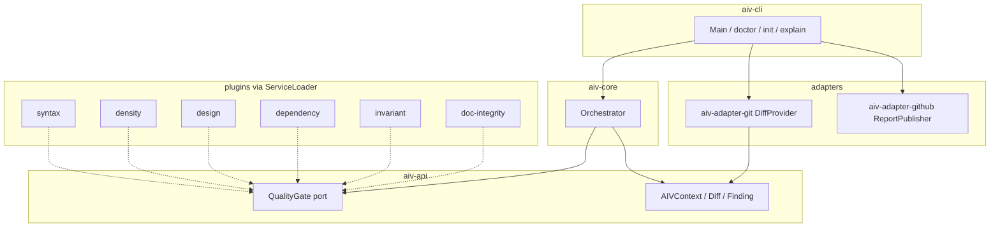
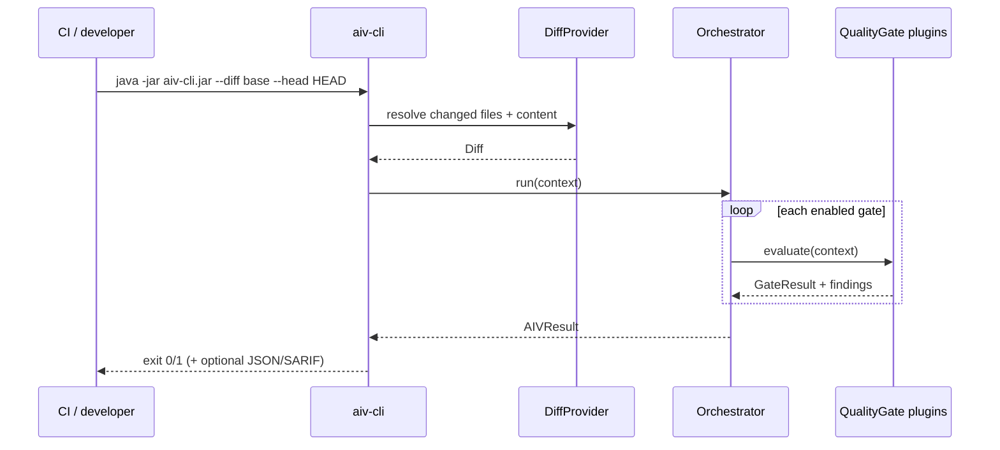

# AIV architecture

This page describes how **AIV Integrity Gate** is structured and how a PR diff becomes a pass/fail decision. It is the technical companion to the [README](../README.md) and [DEVELOPER-GUIDE.md](DEVELOPER-GUIDE.md).

## Design goals

| Goal | How it shows up in the code |
|------|-----------------------------|
| **Diff-scoped** | Gates receive an `AIVContext` with a `Diff` of changed files only (via `aiv-adapter-git`). |
| **Air-gapped** | No network calls during gate evaluation. Rules live in `.aiv/` in the consumer repo. |
| **Precision-first** | Ambiguous input → skip / pass (especially `syntax`). False blocks are treated as product defects. |
| **Extensible** | New gates are Maven modules + `META-INF/services` entries; the CLI discovers them with `ServiceLoader`. |
| **Hard vs advisory** | AIV is the hard gate. Optional Copilot review is advisory only — see [pipeline-aiv-copilot.md](pipeline-aiv-copilot.md). |

## Hexagonal layout

| Module | Responsibility |
|--------|----------------|
| `aiv-api` | Ports (`QualityGate`, `DiffProvider`, `ReportPublisher`) and models (`Diff`, `ChangedFile`, `Finding`, `GateResult`). |
| `aiv-core` | Loads gates, applies exclude paths / skip / fail-fast, aggregates results. |
| `aiv-plugin-*` | One gate per module; registered under `META-INF/services/io.github.vaquarkhan.aiv.port.QualityGate`. |
| `aiv-adapter-git` | Builds the diff from git refs. |
| `aiv-adapter-github` | Stdout report by default; optional GitHub Checks. |
| `aiv-cli` | Shaded runnable JAR; depends on every plugin so ServiceLoader sees them. |

## Runtime flow (one PR)

## Gate map (what each hard check is for)

| Gate id | Hard-blocks on | Soft / skip behavior |
|---------|----------------|----------------------|
| `syntax` | Unparseable Java / Python / YAML / JSON | Skip if toolchain missing, templated YAML, `tsconfig*.json`, Dockerfile-as-`.java` |
| `density` | Low LDR (Java) / low entropy | Refactor net-LOC and trusted authors |
| `design` | Forbidden / missing required patterns from YAML | Empty rules → pass |
| `dependency` | Undeclared Java/Python imports | Java builtins; Python stdlib + first-party `__init__.py` packages |
| `invariant` | Merge markers, TBD/FIXME/XXX, AI edit-artifacts in code | Often disabled until placeholder scope is acceptable |
| `doc-integrity` | Doc path / link / mention rules | Off by default; `auto: true` only when docs change |

## Adding a new gate (maintainer pattern)

1. Create `aiv-plugin-<name>/` with parent `aiv-gate`, depend on `aiv-api`.
2. Implement `QualityGate` (`getId()`, `evaluate`).
3. Register: `META-INF/services/io.github.vaquarkhan.aiv.port.QualityGate`.
4. Add module to root `pom.xml` + `dependencyManagement`, and a dependency in `aiv-cli/pom.xml`.
5. Reach **100% line** JaCoCo on `mvn verify` for that module.
6. Add `aiv-cli/src/main/resources/explain/<id>.md`.

## Related docs

- [DEVELOPER-GUIDE.md](DEVELOPER-GUIDE.md) — build, run, contribute
- [TUTORIAL.md](TUTORIAL.md) — consumer walkthrough
- [DEVELOPER-CONFIGURATION.md](DEVELOPER-CONFIGURATION.md) — config reference
- [pipeline-aiv-copilot.md](pipeline-aiv-copilot.md) — Stage 1 hard / Stage 2 advisory

**Author:** Vaquar Khan
