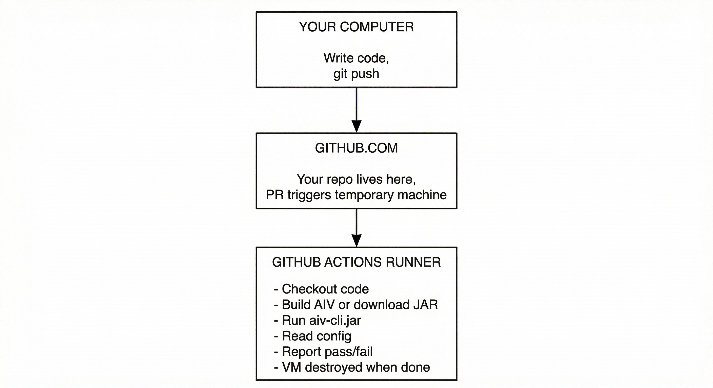

# AIV Deployment Guide

Where the Java code goes, how to deploy it, and how to enable AIV in your project. Step-by-step instructions for beginners.

**Author:** Vaquar Khan

---

## Why Enable AIV?

AIV addresses common pain areas: reviewer overload (too many PRs), low-quality contributions (boilerplate, empty code), design drift (violations of project rules), wrong API usage, unknown imports, and the need to bypass checks for urgent merges or trusted authors. See [README.md](../README.md#problems-and-solutions) for the full pain-area-to-feature mapping.

---

## Part 1: What "Deployment" Means Here

There are **two different things** people mean by "deploy" in AIV:

| What | Where it goes | Who does it |
|------|---------------|-------------|
| **Publish AIV CLI** | Maven Central or GitHub Releases | AIV maintainers (one-time) |
| **Enable AIV in your project** | Your GitHub repo (config + workflow) | You (any project) |

**Important:** AIV does **not** run on a server you own. It runs on **GitHub's servers** when a pull request is opened. You never "deploy" to a VM or cloud instance. You add files to your repo, and GitHub runs the checks automatically.

---

## Part 2: Where Does the Java Code Go?

### Picture This



**Summary:** Your Java code is in your repo. When a PR is opened, GitHub copies it to a temporary machine, runs AIV on it, and throws the machine away. Nothing stays "deployed" on a server.

---

## Part 3: Deploying AIV Into Your Project (Enable AIV Checks)

This is what most people need. You are **not** deploying to a server. You are **adding files** so GitHub runs AIV on every pull request.

### Prerequisites

- A GitHub account
- A repo (your project) on GitHub
- Git installed on your computer
- Java 17 installed (only if you want to run AIV locally first)

---

### Step 1: Open Your Project Folder

1. Open File Explorer (Windows) or Finder (Mac) or your file manager.
2. Go to the folder where your project lives.
   - Example: `C:\Users\YourName\my-project` or `/home/yourname/my-project`
3. This folder should contain your code (e.g. `pom.xml`, `src/`, etc.). This is your **repo root**.

---

### Step 2: Create the `.aiv` Folder

1. Inside your project folder (repo root), create a new folder.
2. Name it exactly: `.aiv` (dot, then aiv, nothing else)
   - **Windows:** Right-click → New → Folder → type `.aiv` → Enter
   - **Mac/Linux:** Open Terminal, `cd` to your project, run: `mkdir .aiv`
3. You should now have: `your-project/.aiv/`

---

### Step 3: Create `config.yaml` Inside `.aiv`

1. Open the `.aiv` folder.
2. Create a new file. Name it exactly: `config.yaml`
   - **Windows:** Right-click in folder → New → Text Document → rename to `config.yaml` (delete the .txt)
   - **Mac/Linux:** `touch .aiv/config.yaml` then edit with any text editor
3. Open `config.yaml` in a text editor (Notepad, VS Code, etc.).
4. Paste this **exactly**:

```yaml
gates:
  - id: density
    enabled: true
    config:
      ldr_threshold: 0.25
      entropy_threshold: 3.8
  - id: design
    enabled: true
    config:
      rules_path: .aiv/design-rules.yaml
  - id: dependency
    enabled: true
  - id: invariant
    enabled: true
```

5. Save the file.
6. Path check: The file must be at `your-project/.aiv/config.yaml`

---

### Step 4: Create `design-rules.yaml` Inside `.aiv`

1. In the same `.aiv` folder, create another file named: `design-rules.yaml`
2. Open it and paste:

```yaml
constraints:
  - id: no-system-exit
    keywords: []
    forbidden_calls:
      - System.exit
    required_calls: []

  - id: no-serialization
    keywords: []
    forbidden_calls:
      - implements Serializable
    required_calls: []
```

3. Save the file.
4. Path check: The file must be at `your-project/.aiv/design-rules.yaml`

---

### Step 5: Create the `.github/workflows` Folder

1. In your project root (same level as `.aiv`), create a folder named: `.github`
2. Inside `.github`, create a folder named: `workflows`
3. You should have: `your-project/.github/workflows/`

---

### Step 6: Create `aiv.yml` Inside `.github/workflows`

1. Open the `.github/workflows` folder.
2. Create a new file named exactly: `aiv.yml`
3. Open it and paste this **entire block**:

```yaml
name: AIV Gate
on:
  pull_request:
    branches: [main, master]

jobs:
  aiv:
    runs-on: ubuntu-latest
    steps:
      - name: Checkout
        uses: actions/checkout@v4
        with:
          fetch-depth: 0

      - name: Set up Java 17
        uses: actions/setup-java@v4
        with:
          distribution: temurin
          java-version: 17

      - name: Clone and build AIV
        run: |
          git clone https://github.com/apache/aiv-gate.git aiv-src
          cd aiv-src
          mvn clean package -DskipTests -B -q

      - name: Run AIV
        run: |
          java -jar aiv-src/aiv-cli/target/aiv-cli-1.0.0-SNAPSHOT.jar \
            --workspace ${{ github.workspace }} \
            --diff origin/${{ github.base_ref }}
```

4. **If your main branch is NOT `main` or `master`:** Change line 5. Example: `branches: [develop]`
5. **If your project IS the AIV project itself:** Use this instead of "Clone and build AIV":
   ```yaml
      - name: Build AIV
        run: mvn clean package -DskipTests -B -q

      - name: Run AIV
        run: |
          java -jar aiv-cli/target/aiv-cli-1.0.0-SNAPSHOT.jar \
            --workspace . \
            --diff origin/${{ github.base_ref }}
   ```
6. Save the file.
7. Path check: The file must be at `your-project/.github/workflows/aiv.yml`

---

### Step 7: Commit and Push to GitHub

1. Open a terminal (Command Prompt, PowerShell, or Terminal).
2. Go to your project folder:
   ```bash
   cd C:\Users\YourName\my-project
   ```
   (Use your actual path.)

3. Check what you added:
   ```bash
   git status
   ```
   You should see: `.aiv/config.yaml`, `.aiv/design-rules.yaml`, `.github/workflows/aiv.yml`

4. Add the files:
   ```bash
   git add .aiv .github
   ```

5. Commit:
   ```bash
   git commit -m "Add AIV configuration and workflow"
   ```

6. Push (replace `main` with your branch name if different):
   ```bash
   git push origin main
   ```

---

### Step 8: Verify Deployment

1. Go to your repo on GitHub in a browser (e.g. `https://github.com/yourname/your-repo`).
2. Create a new branch:
   - Click the branch dropdown (says "main" or "master").
   - Type a new name like `test-aiv`.
   - Click "Create branch".
3. Make a small change (e.g. add a line to README).
4. Commit the change.
5. Click "Compare & pull request" or "Contribute" → "Open pull request".
6. Create the pull request.
7. Wait 1–2 minutes. You should see a check named **AIV Gate** or **aiv**.
8. Click "Details" to see the log. Green = pass, Red = fail.

**You have deployed AIV.** It now runs automatically on every pull request.

---

### Deployment Checklist (Copy and Tick)

| Step | Action | Done? |
|------|--------|-------|
| 1 | Create `.aiv` folder in repo root | |
| 2 | Create `.aiv/config.yaml` with gate config | |
| 3 | Create `.aiv/design-rules.yaml` with constraints | |
| 4 | Create `.github/workflows` folder | |
| 5 | Create `.github/workflows/aiv.yml` with workflow | |
| 6 | `git add .aiv .github` | |
| 7 | `git commit -m "Add AIV"` | |
| 8 | `git push origin main` | |
| 9 | Open a test PR and verify AIV runs | |

---

## Part 4: Publishing the AIV CLI (For Maintainers)

This section is for people who maintain the AIV project and want to publish the JAR so others can download it instead of building from source.

### Where the JAR Goes

| Option | URL / Location | Who can use it |
|--------|----------------|----------------|
| **GitHub Releases** | `https://github.com/apache/aiv-gate/releases` | Anyone with the link |
| **Maven Central** | `https://repo.maven.apache.org/maven2/org/apache/aiv/aiv-cli/` | Anyone with Maven |

---

### Option A: Deploy to GitHub Releases

**Prerequisites:** Write access to the `apache/aiv-gate` repo (or your fork for testing).

#### Step 1: Build the JAR

1. Open terminal.
2. Go to the AIV project root:
   ```bash
   cd /path/to/aiv-gate
   ```
3. Build:
   ```bash
   mvn clean package -DskipTests
   ```
4. The JAR is at: `aiv-cli/target/aiv-cli-1.0.0-SNAPSHOT.jar`

**Note:** If you need a fat JAR (single file with all dependencies), add the Maven Shade plugin to `aiv-cli/pom.xml`. The current build may produce a JAR that expects `lib/` next to it. For a standalone CLI, a fat JAR is simpler.

#### Step 2: Create a GitHub Release

1. Go to `https://github.com/apache/aiv-gate` (or your fork).
2. Click **Releases** (right side).
3. Click **Create a new release**.
4. **Tag:** Type `v1.0.0` (must start with `v`).
5. **Title:** `v1.0.0` or `AIV CLI 1.0.0`.
6. **Description:** Optional release notes.
7. Under **Attach binaries**, drag and drop `aiv-cli-1.0.0-SNAPSHOT.jar` or click to upload.
8. **Rename the file** (optional): `aiv-cli-1.0.0.jar` so the URL is clean.
9. Click **Publish release**.

#### Step 3: Verify

The JAR is now at:
```
https://github.com/apache/aiv-gate/releases/download/v1.0.0/aiv-cli-1.0.0.jar
```

Others can use this in their workflow instead of building from source.

---

### Option B: Deploy to Maven Central

**Prerequisites:**
- Sonatype JIRA account (https://issues.sonatype.org)
- GPG key for signing
- GroupId `org.apache.aiv` must be approved (Apache projects have this)

This is more involved. Summary of steps:

1. Add `maven-deploy-plugin` and `nexus-staging-maven-plugin` to the parent `pom.xml`.
2. Configure `distributionManagement` for Sonatype.
3. Add GPG signing plugin.
4. Run: `mvn clean deploy -P release`
5. Log in to Sonatype Nexus, close and release the staging repo.
6. Wait for sync to Maven Central (often 1–2 hours).

Full Maven Central deployment is documented at: https://central.sonatype.com/publish/publish-guide/

---

## Part 5: Using a Published AIV CLI (Simpler Workflow)

If AIV CLI is published to GitHub Releases or Maven Central, you can use this simpler workflow instead of building from source.

Replace the "Clone and build AIV" and "Run AIV" steps in your `aiv.yml` with:

```yaml
      - name: Download AIV CLI
        run: |
          curl -sL -o aiv-cli.jar \
            "https://github.com/apache/aiv-gate/releases/download/v1.0.0/aiv-cli-1.0.0.jar"

      - name: Run AIV
        run: |
          java -jar aiv-cli.jar --workspace . --diff origin/${{ github.base_ref }}
```

**Change the URL** if the release is at a different version or location.

---

## Part 6: Troubleshooting

| Problem | What to check |
|---------|---------------|
| AIV job does not appear on PR | Workflow file must be at `.github/workflows/aiv.yml` and trigger on `pull_request` |
| "No such file .aiv/config.yaml" | Config must be in repo root: `your-repo/.aiv/config.yaml` |
| "java -jar" fails with "no main manifest" | Build the full project with `mvn clean package`; use the JAR from `aiv-cli/target/` |
| Workflow fails on "clone aiv-gate" | Check GitHub is reachable; repo must be `apache/aiv-gate` or your fork |
| Design rules not applied | Ensure `design-rules.yaml` exists and `keywords` match your files |

---

## Summary

| Question | Answer |
|----------|--------|
| Where does the Java code go? | Your code stays in your repo. When a PR opens, GitHub copies it to a temporary VM and runs AIV there. |
| How do I deploy AIV into my project? | Add `.aiv/config.yaml`, `.aiv/design-rules.yaml`, and `.github/workflows/aiv.yml`, then push. No server to deploy. |
| How do I publish the AIV CLI? | Build the JAR, then upload to GitHub Releases or deploy to Maven Central. |
| Do I need a server? | No. GitHub Actions runs everything. |

---

## See Also

- [TEST.md](TEST.md) — Test cases and GitHub testing steps
- [DEVELOPER-CONFIGURATION.md](DEVELOPER-CONFIGURATION.md) — Config reference
- [TUTORIAL.md](TUTORIAL.md) — General AIV guide
