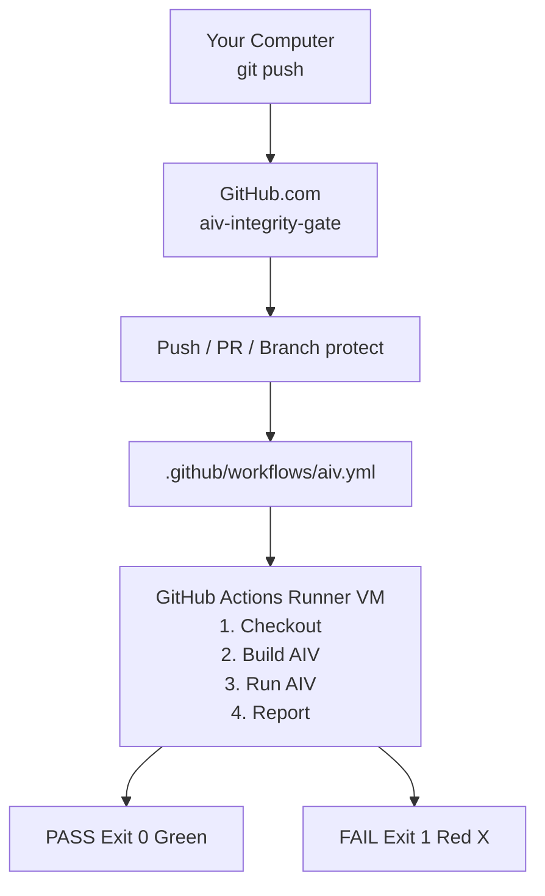

# AIV Example Workflow: How It Works with Git Flow

Step-by-step explanation of the example project and where the Java code runs.

**Author:** Vaquar Khan

---

## 1. Overview

AIV runs when you **push** or open a **Pull Request**. It checks your changed Java files against density, design rules, and invariants. No server to deploy — GitHub runs it automatically.

---

## 2. Where the Java Code Is Deployed

| Location | What lives there |
|----------|------------------|
| **GitHub repo** | Your source code (example-project, aiv-cli, etc.) |
| **GitHub Actions** | Temporary VM where AIV runs on each push/PR |
| **Your computer** | Local copy; you push from here |

**There is no separate deployment.** The code in the repo is what runs. When you push, GitHub:

1. Starts a fresh Ubuntu VM
2. Clones your repo into it
3. Builds AIV (`mvn package -pl aiv-cli`)
4. Runs `java -jar aiv-cli.jar` on the diff
5. Destroys the VM

---

## 3. Git Flow Diagram

---

## 4. Example: Pass and Fail

### Pass (good code)

- **Commit:** `Docs: clarify README description`
- **Change:** README text only, no Java changes
- **AIV:** PASS (no design violations)

### Fail (bad code)

- **Commit:** `Add BadExample for demo (will fail AIV)`
- **Change:** Added `BadExample.java` with `System.exit(0)`
- **AIV:** FAIL — design rule forbids `System.exit`

---

## 5. Validate

| Link | Purpose |
|------|---------|
| [Actions](https://github.com/vaquarkhan/aiv-integrity-gate/actions) | See all AIV runs (pass/fail) |
| [Commits](https://github.com/vaquarkhan/aiv-integrity-gate/commits/main) | See each commit with AIV status |

---

## 6. Files That Control the Flow

| File | Role |
|------|------|
| `.github/workflows/aiv.yml` | Triggers AIV on push and PR |
| `.aiv/config.yaml` | Enables density, design, invariant gates |
| `.aiv/design-rules.yaml` | Forbidden patterns (e.g. System.exit) |

---

## See Also

- [example-project/README.md](../example-project/README.md) — Example project overview
- [DEPLOYMENT.md](DEPLOYMENT.md) — Deployment guide
- [TEST.md](TEST.md) — Test cases
