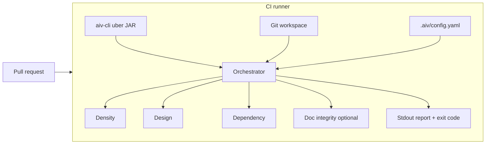

# Tutorial: Getting started with AIV Integrity Gate

**Estimated time:** 45-60 minutes for a first end-to-end setup (local run + CI + optional dashboard)  
**Skill level:** Beginner to intermediate (comfortable with Git, YAML, and running a JAR)  
**Last updated:** April 2026

This tutorial follows the style of AWS technical guides: it explains **what** you are doing, **why** it matters, and **how** to verify each step before moving on. By the end, you will have AIV running on a pull-request diff in your repository, understand how to tune rules, and know where to look when something fails.

---

## What you will learn

- How AIV fits into a pull-request workflow (no servers, no LLM APIs).
- The core concepts: **workspace**, **base ref**, **gates**, and the **report**.
- How to install and run the **shaded CLI** locally (`java -jar`).
- How to add `.aiv` configuration and a **GitHub Actions** workflow.
- How to use the **composite action** from Maven Central.
- How to interpret failures and tune **density**, **design**, and **dependency** gates.
- How to use the optional **static dashboard** under `docs/dashboard/` for historical trends.
- Where to find deeper reference material.

---

## Before you begin

### What AIV is

**AIV (Automated Integrity Validation)** scans **only the diff** between two Git refs in your CI. It applies pluggable **gates** (density, design, dependency, optional doc integrity, and invariant checks for merge markers/placeholders). It does **not** send your source to a third party and does **not** require cloud API keys for its default behavior.

### What AIV is not

- Not a replacement for code review, security scanners, or unit tests.
- Not a license compliance or SBOM tool by default (dependency gate focuses on import consistency with declared dependencies).
- Not tied to GitHub only: any CI that can run Java 17 and Git can run the same JAR.

### Prerequisites

| Requirement | Notes |
|-------------|--------|
| **JDK 17** | Temurin, Oracle, or another Java 17 distribution. |
| **Git** | For local diffs and CI checkout. |
| **Your project** | Any language mix; gates differ by file type (Java gets the deepest density analysis). |
| **Network** | Only for downloading the CLI or cloning this repo - not required **during** a gate run. |

### Costs

- **Running AIV in CI:** bounded by your CI minutes (GitHub-hosted runners, etc.).
- **Maven Central:** the published CLI artifact is free to download for open-source consumers following normal Maven Central terms.

---

## Architecture at a glance



1. **Checkout** gives the runner a full Git history (fetch-depth 0 on GitHub Actions is recommended).
2. **CLI** resolves the diff `base..head` (for PRs, base is usually the target branch; head is your PR branch).
3. **Orchestrator** loads SPI-discovered gates, filters paths, runs enabled gates, aggregates results.
4. **Exit code** `0` = all gates passed; `1` = at least one failure (unless you use skip - see below).

---

## Part 1: Understand the workspace and refs

### Workspace

The **workspace** is the repository root AIV analyzes. In CI it is usually `${{ github.workspace }}`. Locally it is the directory you pass to `--workspace` (default: current directory).

### Base and head refs

| Flag | Meaning |
|------|---------|
| `--diff <base>` | Starting ref for the diff (e.g. `origin/main`). |
| `--head <head>` | Ending ref (default `HEAD`). |

On a pull request, you typically want the diff between the merge-base of your PR branch and the target branch. The examples in this repo use `origin/${{ github.base_ref }}` as the base ref after checkout with `fetch-depth: 0`.

**Checkpoint:** From any clone, run `git fetch origin` and `git log --oneline -5` to ensure refs exist before running AIV.

---

## Part 2: Obtain the CLI (recommended: Maven Central uber JAR)

The published **`aiv-cli`** artifact is a **shaded** (fat) JAR: you can run it with **`java -jar`** without a `lib/` directory.

**Maven coordinates:** `io.github.vaquarkhan.aiv:aiv-cli:1.0.4` (adjust version as newer releases ship).

**Download URL pattern (Maven Central):**

```text
https://repo1.maven.org/maven2/io/github/vaquarkhan/aiv/aiv-cli/VERSION/aiv-cli-VERSION.jar
```

Example for **1.0.4**:

```bash
curl -fsSL -o aiv-cli.jar \
  "https://repo1.maven.org/maven2/io/github/vaquarkhan/aiv/aiv-cli/1.0.4/aiv-cli-1.0.4.jar"
java -jar aiv-cli.jar --version
```

You should see a line like `aiv-cli 1.0.4`.

**Checkpoint:** If `java -jar` fails with `NoClassDefFoundError`, you are not using the shaded Central artifact - re-download from the path above or build with `mvn clean package -pl aiv-cli -am` from this repository.

---

## Part 3: First local run against your repo

### Step 1: Add minimal configuration

From your **application** repository (not necessarily this repo), create:

`.aiv/config.yaml`:

```yaml
gates:
  - id: density
    enabled: true
    config:
      ldr_threshold: 0.25
      entropy_threshold: 5.0
  - id: design
    enabled: true
    config:
      rules_path: .aiv/design-rules.yaml
  - id: dependency
    enabled: true
  - id: invariant
    enabled: true
```

`.aiv/design-rules.yaml` (example - tighten for your project):

```yaml
constraints:
  - id: no-system-exit
    keywords: []
    forbidden_calls: [System.exit]
    required_calls: []
```

### Step 2: Run the CLI

```bash
cd /path/to/your/repo
java -jar /path/to/aiv-cli.jar --workspace . --diff origin/main
```

- Exit code **0**: all enabled gates passed on the diff.
- Exit code **1**: at least one gate reported a failure.

**Checkpoint:** Introduce a trivial violation (e.g. add `System.exit(1);` in a Java file on a branch) and confirm AIV fails; revert and confirm pass.

### Step 3: Optional flags

| Flag | Purpose |
|------|---------|
| `--include-doc-checks` | Enables doc-integrity behavior for this run (in addition to YAML). |
| `--version` / `-V` | Prints CLI version string. |

---

## Part 4: Add GitHub Actions to your repository

You have two common patterns.

### Pattern A - Composite action (downloads JAR from Central)

Minimal job:

```yaml
name: AIV
on:
  pull_request:
    branches: [main]

jobs:
  aiv:
    runs-on: ubuntu-latest
    steps:
      - uses: actions/checkout@34e114876b0b11c390a56381ad16ebd13914f8d5
        with:
          fetch-depth: 0

      - uses: vaquarkhan/aiv-integrity-gate@v1
        with:
          base-ref: origin/${{ github.base_ref }}
          aiv-version: "1.0.4"
```

Inputs are documented in the repository root `action.yml`. You can override **`cli-jar-url`** to point at a GitHub Release asset if needed.

### Pattern B - Build from source (full control)

Clone this repository inside the workflow and run `mvn clean verify -pl aiv-cli -am`, then `java -jar aiv-cli/target/aiv-cli-${VERSION}.jar`. The **`example-project`** and upstream **`.github/workflows/aiv.yml`** show concrete steps.

**Checkpoint:** Open a pull request and confirm a workflow run completes; inspect logs for `=== AIV Report ===`.

---

## Part 5: Global configuration knobs (production teams)

In `.aiv/config.yaml`, alongside `gates`, you can set **top-level** keys (parsed as global config):

| Key | Purpose |
|-----|---------|
| `exclude_paths` | Glob patterns for paths to skip (generated code, etc.). |
| `fail_fast` | If `true`, stop after the first failing gate; default `false` runs all gates. |
| `skip_allowlist` | If non-empty, only listed author emails may use the `/aiv skip` directive (see below). |

Example:

```yaml
exclude_paths:
  - "**/generated/**"

fail_fast: false

skip_allowlist:
  - "release-manager@example.com"

gates:
  # ... gate list ...
```

---

## Part 6: Human override (`/aiv skip`)

For emergencies, a commit on the PR head can request skipping all gates.

- The directive must appear as **a full line** matching the anchored pattern (e.g. `/aiv skip` or `aiv skip`), not as a substring inside unrelated text.
- Only the **latest** commit on the head ref is considered.
- If **`skip_allowlist`** is configured, the latest commit’s author email must match (case-insensitive).

Use sparingly: document policy in your team handbook.

---

## Part 7: Optional static dashboard

The folder **`docs/dashboard/`** in this repository contains a **static HTML/CSS/JS** dashboard (Chart.js via CDN) with light/dark themes. It does not call your CI - it visualizes **JSON** you export or aggregate.

**Data shape (`schema_version: 1`):** an object with a `runs` array; each run has `timestamp`, `branch`, `commit`, `overall_pass`, optional `duration_ms`, and `gates` with `{ id, passed, message? }`.

Serve the folder over HTTP (or GitHub Pages). See `docs/dashboard/README.md` for details.

---

## Part 8: Troubleshooting

| Symptom | What to check |
|---------|----------------|
| `NoClassDefFoundError` when running `java -jar` | Use the **shaded** JAR from Maven Central or build `aiv-cli` with this repo’s POM (shade plugin). |
| Empty diff / unexpected pass | Verify `fetch-depth: 0` on checkout; confirm `--diff` and `--head` refs exist (`git rev-parse`). |
| Too many density failures | Tune `ldr_threshold` / `entropy_threshold`, use `exclude_paths`, or use refactor/trusted-author options where appropriate. |
| Dependency gate noise | Ensure imports align with `pom.xml` / Python requirements; use the gate’s whitelist in config if documented for your version. |
| Design gate matches strings in comments | Prefer rules that make sense for substring matching or narrow with `keywords`; see developer guide. |
| PR comment does not post | On forked PRs, `GITHUB_TOKEN` may be read-only for comments - check workflow permissions; job summary still works. |

---

## Part 9: Next steps

1. Read **[DEVELOPER-CONFIGURATION.md](DEVELOPER-CONFIGURATION.md)** for every gate and YAML key.
2. Read **[DEPLOYMENT.md](DEPLOYMENT.md)** if you publish or consume Maven Central artifacts.
3. Browse module **README.md** files under each Maven module for architecture notes.
4. Run **`mvn clean verify`** if you contribute code - JaCoCo enforces line coverage on modules.

---

## FAQ

**Does AIV upload my code?**  
No - not in the default configuration. It runs locally in the CI runner.

**Does it work without GitHub?**  
Yes. Any CI that provides a Git workspace and Java can run the same command line.

**Can I use it only on Java?**  
Density LDR is Java-focused; other languages get entropy-style checks where configured. Design and dependency gates depend on file types and rules you set.

**Where is the license?**  
See the root **`LICENSE`** file (Apache License 2.0).

---

## Document history

| Version | Changes |
|---------|---------|
| 1.0 | Initial AWS-style tutorial for AIV 1.0.x |

**Author:** Vaquar Khan
