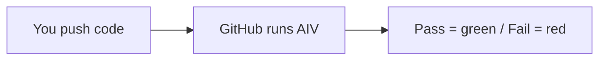
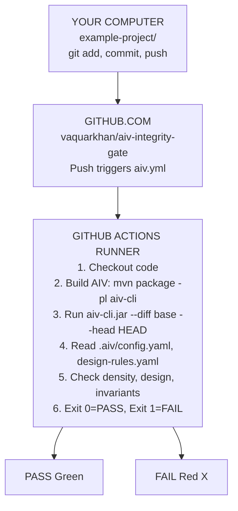

# AIV Example Project

Example project showing how AIV (Automated Integrity Validation) works with Git flow. Easy to understand.

**Author:** Vaquar Khan

---

## How It Works (Simple)



1. You run `git push` or open a Pull Request.
2. GitHub Actions starts a temporary machine.
3. AIV builds and runs on your changed files.
4. If rules pass: green check. If rules fail: red X.

---

## Where the Java Code Goes (Git Flow)

AIV does **not** deploy to a server. It runs on **GitHub's machines** when you push.



**Summary:** Your Java code stays in the GitHub repo. When you push, GitHub runs AIV on a temporary VM. No long-running server.

---

## Pass vs Fail Examples

| Scenario | What you push | AIV result |
|----------|---------------|------------|
| **PASS** | Good code (Calculator, App) | Green check |
| **FAIL** | Code with `System.exit` | Red X — design rule violated |

**Design rule in `.aiv/design-rules.yaml`:** Forbids `System.exit`. If your code contains it, AIV fails.

---

## Validate (Links)

| Link | What you see |
|------|--------------|
| [GitHub Actions](https://github.com/vaquarkhan/aiv-integrity-gate/actions) | All AIV runs — green (pass) or red (fail) |
| [Commits](https://github.com/vaquarkhan/aiv-integrity-gate/commits/main) | Each commit with its AIV status |

---

## Run AIV Locally

From the parent `aiv-gate` repo root:

```bash
# Windows
scripts\validate-example.bat

# Linux/Mac
./scripts/validate-example.sh
```

Or manually:

```bash
mvn package -DskipTests -B -q -pl aiv-cli -am
cd aiv-cli/target
java -jar aiv-cli-1.0.0-SNAPSHOT.jar --workspace /path/to/aiv-gate --diff origin/main
```

---

## Project Structure

```
example-project/
├── .aiv/
│   ├── config.yaml          ← Gate settings (density, design, invariant)
│   └── design-rules.yaml    ← Forbidden: System.exit, Serializable
├── .github/workflows/
│   └── aiv.yml              ← Runs AIV on push and PR
├── src/main/java/com/example/
│   ├── App.java
│   ├── Calculator.java
│   └── BadExample.java      ← Contains System.exit → FAIL
├── pom.xml
└── README.md (this file)
```

---

## Run Tests

```bash
mvn test
```
